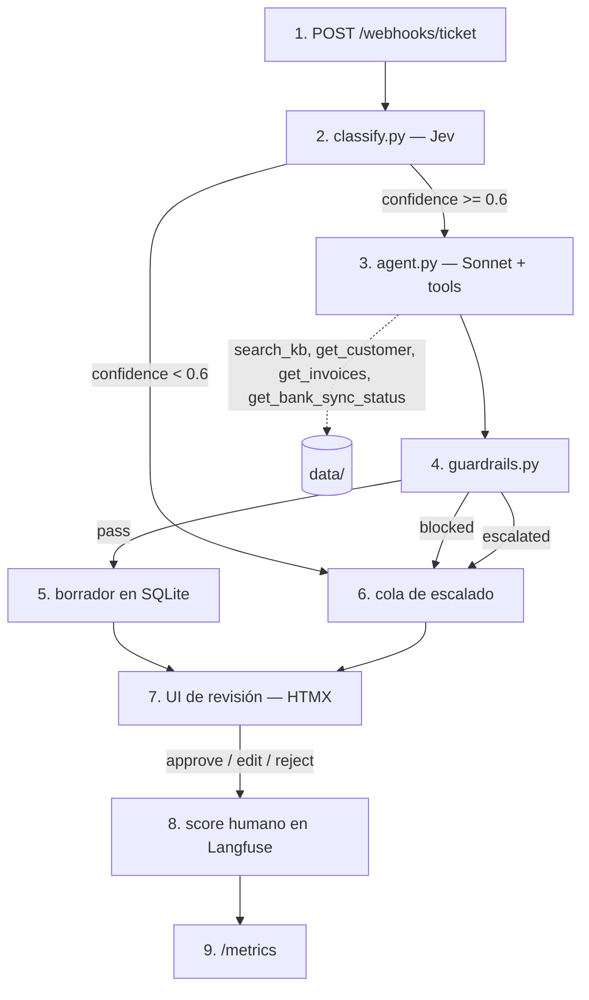
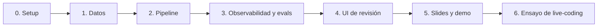

# Plan: haddock CX Triage Copilot

Proyecto para la entrevista técnica con Enric (AI Lead) y Guillermo (Head of Tech).

## Sistema

1. Un ticket entra por un webhook de estilo Zendesk.
2. `classify.py` llama a Jev, un modelo de decisión de TypeSafe AI. Jev devuelve la categoría, la prioridad y el sentimiento. Cada campo tiene una confianza calibrada.
3. `agent.py` ejecuta un bucle de tools con Sonnet. El agente investiga y escribe un borrador.
4. `guardrails.py` revisa el borrador con reglas deterministas.
5. Un borrador válido se guarda en SQLite.
6. Un ticket de baja confianza, bloqueado o escalado va a la cola de escalado.
7. Un agente CX revisa el ticket en la UI.
8. La decisión del agente CX se guarda como score en la traza de Langfuse.
9. `/metrics` muestra el impacto: % aprobado sin editar, tiempo de revisión y coste por ticket.

Langfuse traza los pasos 2 a 8. Cada ticket tiene una traza.

## Contexto

La entrevista dura entre 1h30 y 2h y tiene cuatro partes:
- Slides: 15–20 min.
- Demo: 3–10 min.
- Revisión de código: 10–15 min.
- Live-coding sobre el proyecto: 40–60 min.

El proyecto necesita un frontend sencillo y AI observability. El rol consiste en construir agentes internos que quitan trabajo repetitivo a CX, Sales, Finance y People. El impacto se mide con números.

Decisiones tomadas:
- Proceso: triage de soporte CX. Soporte está en la lista de pendientes de haddock.
- Stack: Python, Claude (SDK de Anthropic) y Langfuse Cloud EU.
- Clasificador: Jev de TypeSafe AI, con `pydantic-ai`. Jev devuelve decisiones tipadas y una confianza calibrada, no texto. Es más rápido y más barato que un LLM. La versión con Haiku queda como fallback y como línea base.
- Tiempo de preparación: 3–5 días.
- La velocidad tiene prioridad sobre la calidad visual de la UI.

**Tesis:** el copilot clasifica, investiga y escribe el borrador. Un agente CX revisa y decide. Cada problema usa la herramienta adecuada:
- Clasificar es una decisión rápida ("System One"): Jev.
- Investigar y escribir necesita razonamiento ("System Two"): un agente con Sonnet.

Es el mensaje de la oferta: "some problems need a multi-agent system, some need 20 lines of code".

## Reglas para todas las fases

- **Spec antes que código.** Cada módulo tiene un spec `docs/specs/<module>.md` con diagramas Mermaid y texto en ASD-STE100 (skill `explaining-clearly`). Escribe el spec antes del código. Si el código cambia, actualiza el diagrama en el mismo commit.
- **Test o eval con cada funcionalidad.** Usa la skill `tdd` para la lógica determinista. Usa un item de eval para el comportamiento del LLM.
- **Un commit al final de cada fase.** Pablo da el OK antes de empezar la fase siguiente.

| Skill | Fase | Uso |
|---|---|---|
| `explaining-clearly` | todas | Specs por módulo con Mermaid |
| `tdd` | 1–4 | Tests antes que el código determinista |
| `claude-api` | 2–3 | Modelos, tool use, prompt caching |
| `eval` | 3, 6 | Verificación adversarial de cada fase |
| `code-review` | 4, 6 | Revisión antes del ensayo |
| `hs-demo`, `hs-pitch` | 5 | Guion de la demo y de las slides |

## Fases

### Fase 0: Setup (≈1 h)

**Objetivo:** un repositorio listo para trabajar con Claude Code.

1. Ejecuta `git init` y `uv init`. Añade las dependencias: `anthropic`, `langfuse`, `fastapi`, `uvicorn`, `jinja2`, `python-multipart`, `pydantic`, `pydantic-ai-slim[typesafe]`, `rank-bm25`, `python-dotenv`, `pytest`.
2. Crea `.env.example`, `.gitignore` y `CLAUDE.md`.
3. Crea las carpetas: `app/`, `app/tools/`, `data/`, `evals/`, `tests/`, `docs/specs/`.
4. Escribe `docs/specs/overview.md` con el diagrama del sistema.
5. Escribe `scripts/hello_langfuse.py`. El script envía una traza de prueba.

6. Escribe `scripts/hello_jev.py`. El script clasifica 3 tickets en español con Jev, dentro de una traza de Langfuse.

**Pablo:** crea el proyecto en Langfuse Cloud EU y una cuenta en console.typesafe.ai. Copia las claves de Langfuse, la `ANTHROPIC_API_KEY` y la `TYPESAFE_API_KEY` en `.env`.

**Hecho cuando:**
- [ ] `uv run pytest` se ejecuta sin errores.
- [ ] `uv run python scripts/hello_langfuse.py` crea una traza visible en Langfuse.
- [ ] `uv run python -m scripts.hello_jev` clasifica bien los 3 tickets en español. La llamada a Jev aparece en la traza de Langfuse.
- [ ] Si Jev falla en español o no aparece en Langfuse, Pablo decide si `classify.py` vuelve a Haiku.

### Fase 1: Datos del dominio (≈2–3 h)

**Objetivo:** un mundo creíble para el agente.

**Specs:** `docs/specs/data.md` (`erDiagram` de clientes, facturas y tickets).

1. Escribe ~15 artículos de help center en `data/kb/*.md`. Temas: facturas no procesadas, OCR, conciliación bancaria, sincronización bancaria, integración con el TPV, inventario, escandallos, P&L, permisos y facturación del plan.
2. Escribe ~10 restaurantes en `data/customers.json`. Cada restaurante tiene un plan, integraciones, facturas y errores de sincronización.
3. Escribe ~40 tickets en español en `data/tickets.jsonl`. Cada ticket tiene etiquetas: `category`, `priority`, `expected_tools` y `key_points`.
4. Incluye casos trampa: un cliente enfadado, una petición de reembolso, una pregunta sobre otro cliente y un ticket ambiguo.
5. Genera los datos con Claude. Revisa las etiquetas a mano: son el ground truth de los evals.

**Hecho cuando:**
- [ ] Un test valida todos los ficheros con modelos pydantic.
- [ ] Cada categoría tiene 3 tickets como mínimo.

### Fase 2: Pipeline (≈4–5 h)

**Objetivo:** del ticket al borrador por CLI, sin UI.

**Specs:** `classify.md`, `tools.md`, `agent.md` (`sequenceDiagram` del bucle), `guardrails.md`, `pipeline.md`.

1. `app/classify.py`: un `Agent("typesafe:jev-1.x")` de `pydantic-ai` con `output_type=Classification`. Fija la versión de Jev; no uses `jev-latest`.
   - `Classification` es un modelo pydantic con enums: categoría, prioridad, idioma y sentimiento.
   - Jev responde a todos los campos en una llamada. Cada campo tiene su confianza en `provider_details["confidence"]`.
   - La regla de escalado usa la confianza de la categoría.
   - Si Jev no responde, `classify.py` usa Haiku con salida estructurada. La traza registra el fallback.
2. `app/tools/`: un registry de tools. Cada tool tiene una función y un schema JSON.
   - `search_kb` usa BM25. Con 15 documentos, una base vectorial es demasiado. El spec explica cuándo usar pgvector.
   - `get_customer`, `get_invoices`, `get_bank_sync_status` y `escalate_to_human`.
3. `app/agent.py`: un bucle de tool use manual con Sonnet, sin framework. El bucle tiene un máximo de 6 iteraciones. Devuelve el borrador, la evidencia citada y la confianza.
4. `app/guardrails.py`: bloquea las promesas de reembolso o de plazo. La detección usa un regex y después una pregunta sí/no a Jev. Bloquea los datos de otro cliente. Escala si la confianza es baja.
5. `app/pipeline.py`: `process_ticket()` ejecuta classify, agent y guardrails.
6. `app/cli.py`: `process data/tickets.jsonl --limit N`.

**Hecho cuando:**
- [ ] `uv run pytest` pasa. Los tests cubren las tools, los guardrails y el parseo de la clasificación, con el LLM mockeado.
- [ ] La CLI procesa 5 tickets. Cada borrador cita su evidencia.

### Fase 3: Observabilidad y evals (≈4–5 h)

**Objetivo:** medir y comparar todo. Es la parte que más se evalúa.

**Specs:** `observability.md` (`sequenceDiagram` de trazas y scores), `evals.md`.

1. **Trazas:** pon `@observe` en el pipeline, en cada tool y en cada iteración del agente. `session_id` es el id del ticket. La metadata incluye la categoría y el cliente.
2. **Prompt management:** `app/prompts.py` lee los prompts de Langfuse con el label `production`. Si Langfuse no responde, usa una copia local. Cada generation queda enlazada a la versión del prompt.
3. **Dataset:** `evals/upload_dataset.py` sube `tickets.jsonl` a un Langfuse Dataset.
4. **Experimento:** `evals/run_experiment.py` ejecuta el pipeline sobre el dataset. Calcula estos scores:
   - accuracy de la clasificación;
   - recall de tools contra `expected_tools`;
   - cobertura de `key_points`, con LLM-as-judge;
   - groundedness, con LLM-as-judge;
   - violaciones de guardrails.
5. **Comparación para las slides:**
   - **Jev contra Haiku en `classify.py`:** accuracy, coste por ticket, latencia y calibración. La calibración compara la confianza con el acierto real, por tramos de 0.1. Así verificamos el claim "calibrated" del vendedor con nuestros datos.
   - Con los datos de calibración, elige el umbral de escalado. El 0.6 es solo el valor inicial.
   - Prompt v1 contra v2 en el agente.
   - Haz una tabla de calidad, coste y latencia.

**Hecho cuando:**
- [ ] Langfuse muestra trazas anidadas con el prompt enlazado.
- [ ] Langfuse muestra 2 ejecuciones del experimento, comparables.

### Fase 4: UI de revisión (≈3–4 h)

**Objetivo:** el puesto de trabajo del agente CX y la fuente de las métricas de impacto.

**Specs:** `ui.md` (`stateDiagram-v2` del ticket), `db.md` (`erDiagram`).

1. FastAPI con Jinja2 y HTMX. `app/db.py` guarda tickets, borradores y revisiones en SQLite.
2. `/`: la bandeja de tickets con categoría, prioridad y estado.
3. `/tickets/{id}`: el ticket, el borrador editable, la evidencia y un enlace a la traza.
4. Aprobar, editar o rechazar. La UI guarda la decisión, la distancia de edición y los segundos de revisión. Después envía estos datos como scores a la traza.
5. `/metrics`: % aprobado sin editar, tiempo de revisión contra la línea base, coste por ticket y volumen por categoría.
6. `POST /webhooks/ticket`: recibe un ticket y lo procesa en segundo plano.

**Hecho cuando:**
- [ ] El flujo completo funciona en el navegador.
- [ ] El score humano aparece en la traza.
- [ ] `/metrics` se actualiza después de cada revisión.

### Fase 5: Slides, demo y revisión de código (≈4 h)

**Objetivo:** explicar bien el qué, el porqué y el cómo.

1. **Slides** en español, 15–20 min:
   1. El día de un agente CX.
   2. Por qué este proceso.
   3. Cuándo un agente y cuándo 20 líneas de código: Jev ("System One") contra Sonnet ("System Two").
   4. Arquitectura: el diagrama de `overview.md`.
   5. Observabilidad y evals: resultados del experimento.
   6. Métricas de impacto.
   7. Cómo lo construí con IA: Claude Code, `CLAUDE.md`, skills y specs.
   8. Cómo lo llevaría a haddock: Zendesk, HubSpot, MCP interno y Slack.
   9. Limitaciones y siguientes pasos.
2. **Guion de la demo**, 8 min como máximo:
   1. Un ticket fácil, aprobado sin cambios.
   2. Un ticket con datos del cliente, con su traza.
   3. Un ticket trampa, escalado.
   4. `/metrics`.
   5. El experimento en Langfuse.
3. **Plan B:** guarda tickets ya procesados y capturas de las trazas. Úsalos si la red o la API fallan.
4. **Revisión de código:** sigue los specs. Orden: `overview.md`, prompts en Langfuse, `agent.md`, `guardrails.md`, `evals.md` y `CLAUDE.md`.

**Hecho cuando:**
- [ ] Un ensayo cronometrado de slides, demo y revisión de código dura 45 min como máximo.

### Fase 6: Ensayo de live-coding (≈4–6 h)

**Objetivo:** llegar con soltura a los 40–60 min de live-coding.

1. Ensaya cada reto en una rama desechable, en 30 min como máximo:
   1. Una tool nueva, `get_pos_integration_status`, con una categoría nueva y un item de eval.
   2. Una alerta en Slack por webhook si la prioridad es urgente.
   3. Un router: si el sentimiento es muy negativo, escala sin escribir borrador.
   4. Un evaluador nuevo de "promesas indebidas" en el experimento.
   5. Un job diario que resume las tendencias de los tickets para producto.
2. Método en la entrevista: aclara el requisito, actualiza el spec, piensa en voz alta, haz commits pequeños, añade un test o un eval y enseña la traza nueva.
3. Prepara respuestas para estas preguntas:
   - ¿Por qué no mastra o LangGraph?
   - ¿Por qué Jev y no un LLM para clasificar? ¿Qué pasa si TypeSafe cae?
   - ¿Cuánto cuesta un ticket a escala?
   - ¿Cómo conectarías Zendesk real?
   - ¿Cómo medirías el ROI en producción?
   - ¿Cómo controlas las alucinaciones?
   - ¿Cómo proteges los datos de los clientes?

**Hecho cuando:**
- [ ] 3 retos resueltos en el tiempo previsto, como mínimo.
- [ ] Las respuestas preparadas están escritas.

## Fuera del código

- Responde a Enric. Elige presencial u online: la oficina suma puntos. Propón una fecha después del día 5 de preparación. Confirma que el live-coding será sobre este repositorio.

## Verificación global

1. `uv run pytest` pasa.
2. `uv run python -m app.cli process data/tickets.jsonl --limit 5` crea trazas anidadas en Langfuse, con coste y prompt.
3. `uv run python evals/run_experiment.py` crea un experimento comparable en Langfuse.
4. `uv run uvicorn app.main:app` permite aprobar y editar un ticket. El score humano aparece en la traza y `/metrics` se actualiza.
5. Un ensayo completo cronometrado.
