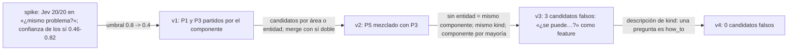

# Resultados de la Fase 3

Dataset `cx-tickets`: 40 tickets etiquetados (`data/tickets.jsonl`). Cada ejecución está en Langfuse → Datasets → `cx-tickets` → Runs. Los detalles por ticket están en `evals/results/<run>.json`.

## Diagram

```mermaid
flowchart LR
    n1["1. baseline-jev-v1"] -->|"juez Haiku: groundedness 0.63"| n2["2. análisis de errores del juez"]
    n2 -->|"evidencia doble-escapada, juez incoherente"| n3["3. juez v3 + evidencia parseada"]
    n3 --> n4["4. v1 contra v2 con el juez v3"]
    n4 -->|"Haiku y Sonnet coinciden solo en el 56%"| n5["5. juez = Sonnet (config en Langfuse)"]
    n5 --> n6["6. v3 del prompt del agente"]
    n6 --> n7["7. decisión: production sigue en v1"]
```

1. La primera ejecución da una groundedness de 0.63.
2. El análisis de errores muestra que el problema está en el juez, no en el agente.
3. El juez v3 lee la evidencia parseada y busca cada afirmación antes de listarla.
4. Con el juez v3 se comparan los prompts v1 y v2 del agente.
5. Haiku como juez coincide con Sonnet solo en el 56% de los casos de la v2. El juez pasa a Sonnet: es un cambio de `config` en Langfuse, sin deploy.
6. La v3 del prompt corrige los efectos de la v2.
7. El label `production` sigue en la v1.

## Clasificador: Jev contra Haiku

Solo clasificación, 40 tickets.

| Campo | Jev (`jev-1.13.0`) | Haiku 4.5 |
|---|---|---|
| Categoría | 87.5–90% | **95%** |
| Prioridad | **80–85%** | 72.5% |
| Sentimiento | 57.5–62.5% | **72.5%** |
| Idioma | 100% | 100% |
| Confianza calibrada | **sí, ECE 0.065–0.11** | no |
| Coste por ticket | ~$0.00003 | ~$0.001 |

Los rangos de Jev vienen de 4 ejecuciones.

**Calibración de Jev, categoría.** Con confianza de 0.9 o más (31 de 40 tickets), Jev acierta el 97% en todas las ejecuciones. Por debajo de 0.9 acierta entre el 33% y el 100%, con 9 tickets. La confianza alta es fiable. La confianza baja no es estable entre ejecuciones.

**Conclusión.** Haiku acierta más la categoría. Jev da una confianza que se puede usar para enrutar y cuesta unas 30 veces menos. Los errores de categoría se concentran en tickets ambiguos (`other`) y en la frontera entre `account` y `bank`.

## Umbral de escalado por confianza

| Umbral | Tickets escalados sin agente | Errores de categoría detectados |
|---|---|---|
| 0.6 (actual) | 2/40 | 1/5 |
| 0.8 | 8/40 | 4/5 |
| 0.9 | 9/40 | 4/5 |

La categoría no cambia el trabajo del agente: solo sirve para enrutar y para las métricas. Subir el umbral escala hasta el 20% de los tickets sin borrador, y entre ellos hay casos que el agente resuelve bien, como T-025. Con 0.6, la regla causa entre 1 y 2 escalados incorrectos por ejecución, porque la confianza de Jev varía cerca del umbral.

**Recomendación:** no escalar por la confianza de la categoría. Usarla solo para marcar "revisar la categoría" en la UI. El escalado depende del agente y de los guardrails. Pendiente de la decisión de Pablo.

## Prompt del agente: v1, v2, v3

Juez Sonnet. La v1 y la v2 se volvieron a juzgar con `evals/rejudge.py`.

| Métrica | v1 (`production`) | v2 | v3 (`staging`) |
|---|---|---|---|
| Formato correcto para el canal | 0.40 | **0.97** | **0.97** |
| Groundedness | 0.95 | 1.00 | 1.00 |
| Cobertura de key points | **0.93** | 0.88 | 0.89 |
| Escalado correcto | **0.975** | 0.85 | 0.875 |
| Tool recall | **0.975** | 0.925 | 0.958 |
| Coste (40 tickets) | $0.44–0.68 | $0.67 | $0.72 |

- **v2:** formato por canal y chat de 80 palabras como máximo. Corrige el formato. Las respuestas cortas pierden puntos clave, y el agente baja su confianza en chat (T-030, T-032, T-035), lo que provoca escalados.
- **v3:** el formato de email de la v2, sin límite de palabras en chat. El formato sigue bien. En esta ejecución, el agente no escala T-021 ni T-027, que sí debían escalarse.

**Decisión: `production` sigue en la v1.** La v3 corrige el formato, pero una sola ejecución de 40 tickets no prueba que el escalado no empeore. El agente no es determinista. Siguiente paso: 3 ejecuciones de v1 y de v3, y comparar las medias.

## El eval también evalúa los datos y el juez

- **Juez:** la primera groundedness (0.63) era un error del juez. La evidencia llegaba como JSON doblemente escapado, y Haiku listaba afirmaciones y luego decía que tenían soporte.
- **Etiqueta discutible (T-040):** el cliente da las gracias porque el banco ya funciona, pero sus datos dicen que CaixaBank sigue en error. El agente se lo avisa. La respuesta del agente es probablemente mejor que la etiqueta.
- **Coste por ticket:** unos $0.017 con Sonnet. La caché del prompt reduce el coste cuando los tickets llegan seguidos.

## Radar de producto: clustering (fase R1)

Dataset `data/radar/`: 250 tickets, 7 problemas plantados, 40 señuelos (`docs/specs/data.md`). `python -m evals.run_clustering`. Cada ejecución deja `evals/results/<run>.json` y una traza `radar-eval` con los scores.

| Score | v1 | v2 | v3 | v4 (Jev) | v4 matcher Haiku |
|---|---|---|---|---|---|
| ARI | 0.915 | 0.869 | 0.996 | **0.989** | 0.994 |
| Purity | 0.993 | 0.903 | 1.0 | **1.0** | 1.0 |
| Problemas mezclados | 0 | 1 | 0 | **0** | 0 |
| Ruido fuera de los problemas | 0.887 | 0.847 | 0.855 | **0.935** | 0.944 |
| `kind` correcto | 0.924 | 0.904 | 0.904 | **0.952** | 0.956 |
| Plantados detectados (6) | 6 | 6 | 6 | **6** | 6 |
| Candidatos falsos | 3 | 1 | 3 | **0** | 0 |
| Segundos (250 tickets) | 48 | 46 | 50 | **47** | 101 |

**Detección (v4).** Cada problema plantado llega a `candidate` con 2 a 5 tickets suyos:

| Problema | Tickets | Detectado con | Días después del inicio |
|---|---|---|---|
| P1 OCR de Garrido | 32 | 3 | 0.8 |
| P2 Kutxabank | 22 | 3 | 0.5 |
| P3 Revo duplica ventas | 26 | 3 | 1.9 |
| P4 escandallos | 18 | 3 | 1.8 |
| P5 Excel del P&L con IVA | 14 | 4 | 4.6 |
| P6 P&L multi-local (feature) | 12 | 5 | 16.7 |
| P7 Safari (2 clientes starter) | 2 | no llega: correcto | — |

**Decisiones:**
- El matcher sigue en Jev. Haiku da la misma calidad, pero tarda el doble y cuesta más.
- El umbral de confianza baja a 0.4. Los errores de v1 a v3 no venían del matcher, sino del filtro de candidatos y del `kind`.
- P6 tarda 16.7 días porque es una feature con una curva plana: hasta el quinto ticket no hay 3 clientes distintos.

**Limitaciones:**
- Los textos son plantillas con variación. Un ticket real es más variado, así que este resultado es una cota superior.
- Dos ejecuciones con los mismos datos no son idénticas: Jev no es determinista (`kind` correcto 0.904–0.952). Por eso el eval mide la frontera de `kind`, y la petición a producto siempre pasa por una persona.
