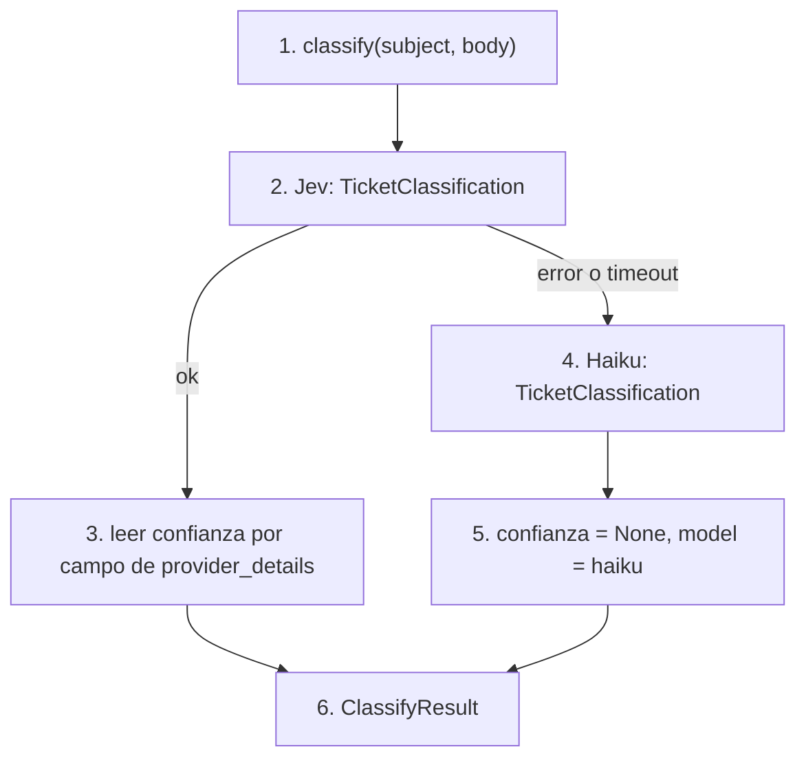

# classify

## Purpose
`app/classify.py` decide la categoría, la prioridad, el sentimiento y el idioma de un ticket. Usa Jev, un modelo de decisión: devuelve valores tipados y una confianza calibrada por campo. Si Jev falla, usa Haiku.

## Diagram



## Interface

```python
class TicketClassification(BaseModel):
    category: Category      # app/domain.py
    priority: Priority
    sentiment: Sentiment
    language: Language

@dataclass
class ClassifyResult:
    classification: TicketClassification
    confidence: dict[str, float] | None   # None con el fallback
    model: str

def classify(subject: str, body: str, *, model=None, fallback_model=None) -> ClassifyResult
```

Los modelos están en `app/config.py`: `JEV_MODEL` (versión fija) y `FALLBACK_CLASSIFIER_MODEL`. Los parámetros `model` y `fallback_model` existen para los tests.

## Behavior

1. `classify()` une el asunto y el cuerpo en un texto.
2. Llama a Jev con `output_type=TicketClassification`. Jev no recibe instrucciones: las descripciones de los campos son las preguntas.
3. Lee la confianza de cada campo en `result.response.provider_details["confidence"]`.
4. Si Jev lanza una excepción, llama a Haiku con el mismo `output_type`.
5. Con Haiku, la confianza es `None`. La traza registra el modelo usado.
6. Devuelve un `ClassifyResult`.

La descripción de `priority` contiene las definiciones de `docs/specs/data.md`. En la Fase 0, Jev marcó como no urgente una sincronización bancaria antes del cierre. Las definiciones explícitas corrigen ese caso.

## Errors and edge cases

- Jev y Haiku fallan: la excepción sube. `pipeline.py` la registra en la traza.
- Confianza `None`: `pipeline.py` no aplica la regla de escalado por confianza.

## Done when
- [ ] Un test con `TestModel` devuelve un `ClassifyResult` válido.
- [ ] Un test con un modelo que falla usa el fallback y devuelve `confidence = None`.
- [ ] El experimento de la Fase 3 mide la accuracy de cada campo contra las etiquetas.
