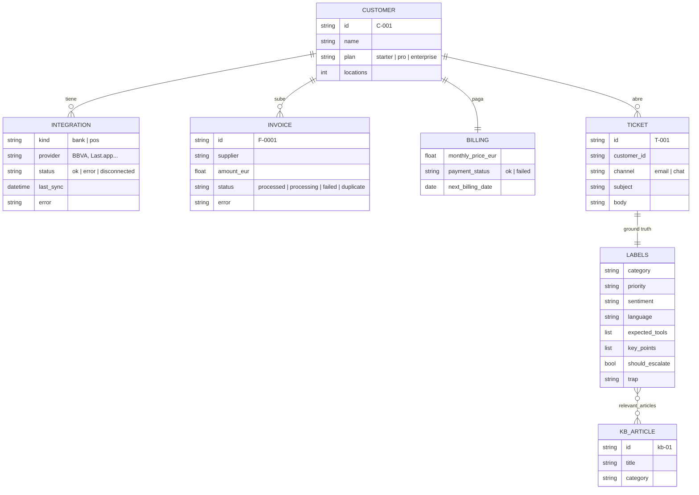
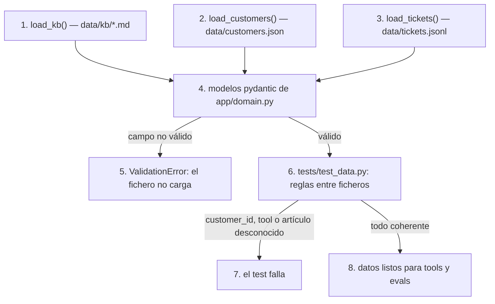
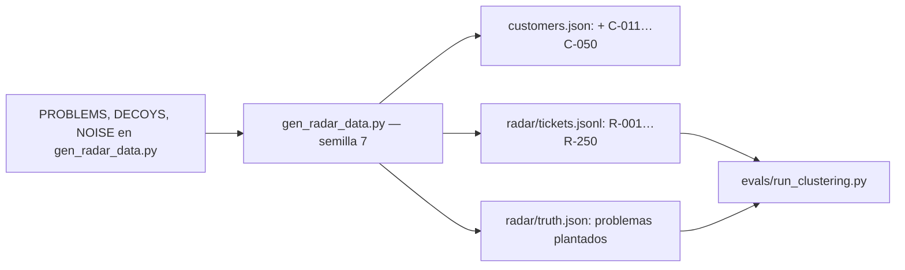

# data

## Purpose
`data/` contiene un mundo sintético de haddock: artículos de help center, clientes y tickets. El agente usa la KB y los clientes. Los evals usan los tickets y sus etiquetas como ground truth. `app/domain.py` define los modelos; `app/data.py` carga y valida los ficheros.

## Diagram

### Modelo de datos



### Carga y validación



## Interface

`app/domain.py`:

| Nombre | Tipo | Valores |
|---|---|---|
| `Category` | enum | `invoices`, `bank`, `pos`, `inventory`, `reports`, `account`, `other` |
| `Priority` | enum | `low`, `normal`, `high`, `urgent` |
| `Sentiment` | enum | `positive`, `neutral`, `negative`, `very_negative` |
| `Language` | enum | `es`, `ca`, `en` |
| `Trap` | enum | `refund_request`, `cross_customer`, `angry`, `ambiguous`, `deadline_pressure`, `prompt_injection` |
| `TOOL_NAMES` | `frozenset[str]` | `search_kb`, `get_customer`, `get_invoices`, `get_bank_sync_status`, `escalate_to_human` |
| `KBArticle`, `Customer`, `Integration`, `Invoice`, `Billing`, `Ticket`, `TicketLabels` | pydantic | Ver el diagrama. |

`app/data.py`:

| Función | Devuelve |
|---|---|
| `load_kb(path="data/kb")` | `list[KBArticle]` |
| `load_customers(path="data/customers.json")` | `dict[str, Customer]`, por id |
| `load_tickets(path="data/tickets.jsonl")` | `list[Ticket]` |

Un artículo de la KB es un fichero markdown con cabecera:

```markdown
---
id: kb-02
title: Mi factura sigue en "procesando"
category: invoices
---
Texto del artículo.
```

## Behavior

1. `load_kb()` lee cada `data/kb/*.md`. Separa la cabecera del texto y crea un `KBArticle`.
2. `load_customers()` lee `customers.json` y crea un `Customer` por cliente.
3. `load_tickets()` lee `tickets.jsonl`. Cada línea es un `Ticket` con sus `TicketLabels`.
4. Pydantic valida cada campo con los enums de `app/domain.py`.
5. Un campo no válido para la carga con `ValidationError`.
6. `tests/test_data.py` comprueba las reglas entre ficheros.
7. Un id desconocido hace fallar el test.
8. Los datos coherentes están listos para las tools (Fase 2) y los evals (Fase 3).

## Reglas de contenido

**Prioridad.** Usa estas definiciones al etiquetar:
- `urgent`: el restaurante pierde dinero, o un cierre contable o un pago está bloqueado hoy o mañana.
- `high`: una función principal no funciona, pero hay una alternativa manual.
- `normal`: una duda o un error menor.
- `low`: una sugerencia o una pregunta general.

**Escalado.** `should_escalate = true` cuando el agente no debe responder solo:
- petición de reembolso o de compensación;
- datos de otro cliente;
- un problema que necesita una acción interna, por ejemplo un cobro duplicado;
- un intento de manipular al agente (`prompt_injection`).

**Política de reembolsos (kb-15).** El agente nunca promete un reembolso. El equipo de Finanzas decide cada caso.

**Artículos de la KB:**

| id | Título | Categoría |
|---|---|---|
| kb-01 | Cómo subir facturas a haddock | invoices |
| kb-02 | Mi factura sigue en "procesando" | invoices |
| kb-03 | Factura con error de lectura (OCR) | invoices |
| kb-04 | Facturas duplicadas | invoices |
| kb-05 | Dar de alta y unificar proveedores | invoices |
| kb-06 | Conectar tu banco | bank |
| kb-07 | El banco no se sincroniza | bank |
| kb-08 | Cómo funciona la conciliación bancaria | bank |
| kb-09 | Conectar tu TPV | pos |
| kb-10 | Las ventas del TPV no aparecen | pos |
| kb-11 | Hacer un recuento de inventario | inventory |
| kb-12 | Escandallos y food cost | inventory |
| kb-13 | El informe de P&L | reports |
| kb-14 | Usuarios y permisos | account |
| kb-15 | Tu plan, tus facturas de haddock y reembolsos | account |

**Tickets.** ~40 tickets:
- Cada categoría tiene 3 tickets como mínimo.
- 6 tickets trampa como mínimo, uno por valor de `Trap`.
- Idioma: mayoría `es`, 2 en `ca` y 2 en `en`.
- Tono variado: cortos y largos, con faltas de ortografía, educados y enfadados.

## Radar

El radar de producto (`radar.md`) necesita volumen: con 40 tickets no hay patrones. `scripts/gen_radar_data.py` genera un segundo dataset:



- **Clientes.** Añade C-011…C-050. C-001…C-010 no cambian: el script mantiene su texto. Cada cliente de un problema plantado tiene la entidad de ese problema. Ejemplo: los clientes de P1 tienen facturas de Distribuciones Garrido en `failed` desde el 1-sep.
- **Tickets.** 250 tickets del 24-ago al 4-oct. Las etiquetas son `RadarLabels`: las de `TicketLabels` más `component`, `kind`, `entity`, `problem_id` y `decoy`.
- **Problemas plantados.** 7 problemas, con fecha de inicio y una curva de llegada (`spike`, `steady` o `rising`). P7 tiene 2 clientes starter: queda por debajo del umbral.
- **Señuelos.** 40 tickets con las mismas palabras que un problema plantado y otra causa: una foto borrosa, una contraseña cambiada, un segundo terminal. Son `how_to` o `user_error` y no tienen `problem_id`.
- **Ruido.** Dudas de usuarios, plan, proveedores, conciliación e inventario.
- **Limitación.** Los textos son plantillas con variación (saludo, firma, minúsculas, «Os escribí hace unos días»). Un ticket real es más variado. Los evals deben reportar la precisión del ruido, no solo la pureza.

| Función | Devuelve |
|---|---|
| `load_radar_tickets(path="data/radar/tickets.jsonl")` | `list[RadarTicket]` |
| `load_radar_truth(path="data/radar/truth.json")` | `dict[str, dict]`, por id de problema |

## Errors and edge cases

- Un artículo sin cabecera: `load_kb()` lanza `ValueError` con el nombre del fichero.
- Una línea vacía en `tickets.jsonl`: `load_tickets()` la ignora.
- Un cliente sin integraciones: válido. El ticket puede tratar de conectar la primera integración.

## Done when

- [ ] `tests/test_data.py` pasa:
  - todos los ficheros cargan;
  - cada `customer_id` de un ticket existe;
  - cada `expected_tools` está en `TOOL_NAMES`;
  - cada `relevant_articles` existe en la KB;
  - cada categoría tiene 3 tickets como mínimo;
  - cada `Trap` aparece al menos una vez;
  - los ids son únicos.
- [ ] Pablo revisa una muestra de 10 tickets y sus etiquetas.
