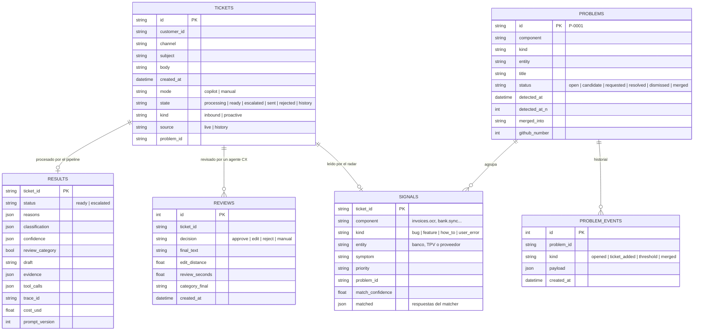

# db

## Purpose
`app/db.py` guarda en SQLite los tickets, los resultados del pipeline y las revisiones de los agentes CX. Las métricas de impacto (`/metrics`) se calculan con estas tablas.

## Diagram



## Interface

```python
def connect(path: str | None = None) -> sqlite3.Connection   # HADDOCK_DB, por defecto haddock.db
def insert_ticket(db, ticket: TicketIn) -> str                 # devuelve el mode
def save_result(db, result: TicketResult) -> None
def list_tickets(db) -> list[dict]
def get_ticket(db, ticket_id) -> dict | None
def record_review(db, ticket_id, decision, final_text, review_seconds, category_final) -> Review
def metrics(db) -> dict
def mode_for(ticket_id: str) -> str                          # manual para ~20% de los ids
```

## Behavior

1. `insert_ticket()` guarda el ticket con `state = processing` y le asigna un `mode`.
2. `mode_for()` usa un hash estable del id: el mismo ticket siempre tiene el mismo modo. Un 20% de los tickets va a modo `manual`.
3. `save_result()` guarda el resultado y cambia el `state` a `ready` o `escalated`.
4. `record_review()` guarda la decisión y cambia el `state` a `sent` o `rejected`.
5. La distancia de edición es `1 - SequenceMatcher(borrador, texto final).ratio()`. 0 significa sin cambios.
6. `metrics()` calcula las métricas de impacto.
7. `connect()` añade las columnas nuevas (`LATE_COLUMNS`) a una base de datos antigua. `insert_ticket()` nombra sus columnas, así funciona con las dos.
8. `insert_ticket(source="history")` guarda un ticket del pasado para el radar, con `state = history`. `list_tickets()` lo excluye: no aparece en la cola ni en `/metrics`. `get_ticket()` sí lo devuelve.

**Métricas de `metrics()`:**

| Métrica | Definición |
|---|---|
| `approved_unedited_rate` | approve / revisiones en modo copilot |
| `avg_seconds_copilot` | segundos medios por ticket en modo copilot |
| `avg_seconds_manual` | segundos medios por ticket en modo manual: la línea base medida |
| `seconds_saved_per_ticket` | `avg_seconds_manual - avg_seconds_copilot` |
| `cost_per_ticket_usd` | coste medio del agente |
| `escalation_rate` | tickets escalados / tickets procesados |
| `category_corrections` | revisiones donde el agente CX cambió la categoría |
| `by_category` | tickets por categoría |

Sin revisiones manuales, `avg_seconds_manual` es `None`. La UI lo dice; no inventa una línea base.

## Errors and edge cases
- Un webhook con un id que ya existe: `insert_ticket()` lanza `ValueError`. El endpoint responde 409.
- Una segunda revisión del mismo ticket: se guarda y la última decide el `state`.

## Done when
- [ ] Tests: los estados cambian según el diagrama; `mode_for()` es estable; las métricas son correctas con datos conocidos; la distancia de edición es 0 sin cambios.
