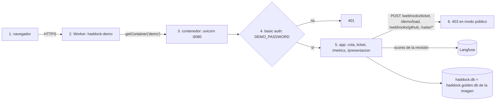

# deploy

## Purpose
La demo pública corre en Cloudflare Containers. Enric y Guillermo abren una URL, escriben una contraseña y usan la app con los tickets ya procesados. La versión pública no llama a Sonnet ni a Jev: nadie puede gastar tokens.

## Diagram



1. El navegador abre la URL de `workers.dev`.
2. El Worker envía cada petición a una sola instancia, `demo`. Así todas las peticiones ven la misma base de datos.
3. El contenedor ejecuta la imagen del `Dockerfile`.
4. Si `DEMO_PASSWORD` existe, la app pide basic auth en todas las rutas menos `/static`.
5. Con la contraseña, la app funciona como en local: revisar, aprobar, `/metrics` y la presentación.
6. Con `HADDOCK_PUBLIC=1`, el webhook y la carga de demo responden 403 y la UI oculta el botón «Demo». El radar se puede leer, pero no escribe: redactar, aprobar, rechazar, «Comprobar GitHub» y el webhook de GitHub responden 403, y sus botones no aparecen.

## Interface

| Variable | Dónde | Efecto |
|---|---|---|
| `DEMO_PASSWORD` | secret del Worker → contenedor | Activa basic auth. Usuario libre. |
| `HADDOCK_PUBLIC` | `envVars` del contenedor | `1`: sin pipeline, sin webhook, sin «Demo». |
| `LANGFUSE_*` | secrets del Worker → contenedor | Enlaces a las trazas y scores de las revisiones. |

La imagen no lleva `ANTHROPIC_API_KEY` ni `TYPESAFE_API_KEY`.

```
npx wrangler secret put DEMO_PASSWORD          # una vez por secret, desde deploy/
npx wrangler deploy                            # Docker en marcha: construye y sube la imagen
```

## Behavior

1. La imagen copia `haddock.golden.db` como `haddock.db`. `scripts/build_golden.py` la construye: la cola en vivo de `haddock.db` sin revisiones, más el radar de una ejecución de eval (`data/snapshots/radar-notices.db`). Tiene un problema en cada estado: candidatos con su petición redactada, uno en producto (`--requested P-xxxx=<issue>`) y uno resuelto con sus avisos en la cola. La demo pública enseña el ciclo completo sin llamar a ningún LLM.
2. El contenedor duerme tras 30 min sin peticiones. El disco no persiste: al despertar, la base de datos vuelve al estado de `haddock.golden.db`. Las revisiones de una sesión se pierden al dormir, pero sus scores ya están en Langfuse.
3. Para cambiar el estado inicial, vuelve a ejecutar `python -m scripts.build_golden` y despliega.

## Errors and edge cases
- Contraseña incorrecta o ausente: 401 con `WWW-Authenticate: Basic`.
- Langfuse no responde: la página del ticket no muestra el enlace a la traza; la revisión se guarda igual.
- Arranque en frío: la primera petición tras dormir tarda unos segundos.

## Done when
- [ ] Tests: sin `DEMO_PASSWORD` no hay auth; con ella, 401 sin credenciales y 200 con ellas; `/static` no pide auth; con `HADDOCK_PUBLIC=1` el webhook y `/demo/load` dan 403.
- [ ] La URL pública pide la contraseña y muestra la cola con los tickets precalculados.
