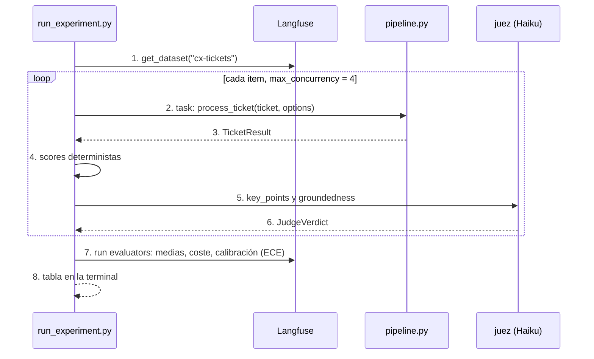
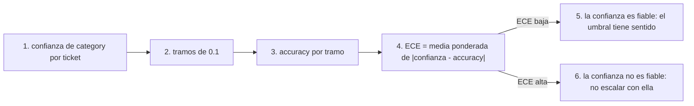

# evals

## Purpose
`evals/` mide la calidad del pipeline contra las etiquetas de `data/tickets.jsonl`. Cada ejecución es un experimento de Langfuse sobre el dataset `cx-tickets`. Dos ejecuciones con variantes distintas se comparan en la UI de Langfuse.

## Diagram

### Un experimento



### Calibración de la confianza



## Interface

```
python -m evals.upload_dataset                       # crea o actualiza cx-tickets (idempotente)
python -m evals.run_experiment --run-name jev-v1     # pipeline completo
python -m evals.run_experiment --classify-only --classifier haiku --run-name haiku-classify
python -m evals.run_experiment --prompt-label staging --run-name agent-prompt-v2
python -m evals.run_experiment --limit 5             # prueba rápida
```

| Score | Tipo | Nivel | Cómo |
|---|---|---|---|
| `category_correct`, `priority_correct`, `sentiment_correct`, `language_correct` | BOOLEAN | ticket | Igual a la etiqueta. |
| `category_confidence` | NUMERIC | ticket | Confianza de Jev. Solo con Jev. |
| `escalation_correct` | BOOLEAN | ticket | `status == escalated` igual a `should_escalate`. |
| `tool_recall` | NUMERIC | ticket | Tools esperadas que el agente usó / tools esperadas. |
| `key_points_coverage` | NUMERIC | ticket | Juez: puntos clave cubiertos / puntos clave. |
| `groundedness` | NUMERIC | ticket | Juez: 1 si todos los datos del borrador están en la evidencia. |
| `guardrail_blocked` | BOOLEAN | ticket | El borrador tiene un motivo de bloqueo. |
| `cost_usd` | NUMERIC | ticket | Coste del agente. |
| `avg_*`, `total_cost_usd`, `category_ece` | NUMERIC | ejecución | Medias, suma y calibración. |

## Behavior

1. `run_experiment.py` lee el dataset `cx-tickets` de Langfuse.
2. La task reconstruye el `Ticket` y ejecuta `process_ticket()` con las `RunOptions` de la variante.
3. El resultado vuelve como output del item.
4. Los evaluadores deterministas comparan el output con las etiquetas.
5. El juez recibe el ticket, los puntos clave, el borrador y la evidencia que leyó el agente.
6. El juez devuelve qué puntos clave cubre el borrador y qué datos no tienen soporte.
7. Los evaluadores de ejecución calculan las medias, el coste total y la calibración.
8. La terminal muestra una tabla. Langfuse guarda la ejecución para comparar.

**Juez.** Haiku con salida estructurada (`messages.parse`). El prompt `eval-key-points-judge` vive en Langfuse. El juez no ve las etiquetas de clasificación, solo los puntos clave.

**Variantes** (`RunOptions` de `pipeline.py`):
- `classifier`: `jev` o `haiku`.
- `prompt_label`: el label del prompt del agente en Langfuse (`production`, `staging`).
- `classify_only`: no ejecuta el agente. Sirve para comparar clasificadores sin coste de Sonnet.

## Errors and edge cases
- Un ticket sin `key_points`: no ocurre; `tests/test_data.py` lo impide.
- Un ticket escalado sin borrador: `key_points_coverage` y `groundedness` no se calculan.
- El juez falla: el item no tiene esos dos scores. La ejecución sigue.
- `expected_tools` vacío: `tool_recall = 1`.

## Done when
- [ ] El dataset `cx-tickets` tiene 40 items en Langfuse.
- [ ] Dos ejecuciones comparables en Langfuse: Jev contra Haiku y prompt v1 contra v2.
- [ ] La tabla de resultados está en `docs/results.md` para las slides.
- [x] Decisión con los datos de calibración: la confianza de la categoría no escala; marca `review_category` por debajo de `CATEGORY_REVIEW_CONFIDENCE = 0.9` (docs/results.md).
