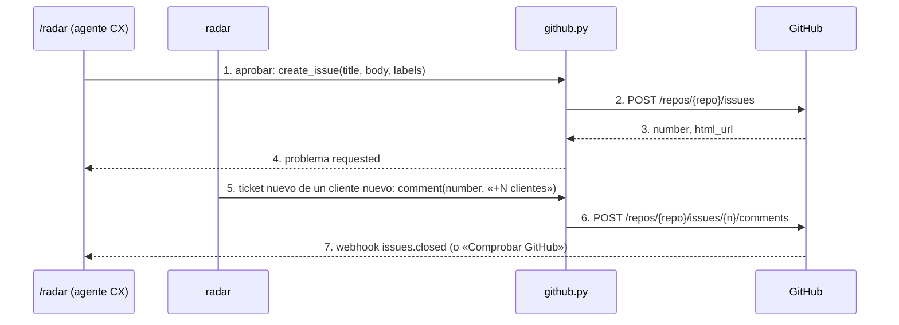

# github

## Purpose
`app/github.py` es el cliente de GitHub del radar: crea issues, comenta, lee su estado y verifica los webhooks. Usa `httpx` contra la API REST, sin SDK. Cada llamada es un span `tool` en Langfuse. El token nunca entra en un span.

## Diagram



## Interface

```python
class GitHub:
    def __init__(self, token: str, repo: str, *, api=GITHUB_API, transport=None)
    def create_issue(self, title: str, body: str, labels: list[str]) -> dict   # {number, url}
    def comment(self, number: int, body: str) -> str                           # url del comentario
    def get_issue(self, number: int) -> dict                                   # {number, state, state_reason, url}
    def list_issues(self, *, state="all", labels="radar", since=None) -> list[dict]

def from_env() -> GitHub | None          # GITHUB_TOKEN y GITHUB_REPO; None si falta uno
def verify_signature(body: bytes, header: str | None, secret: str) -> bool
```

`.env`:
- `GITHUB_TOKEN`: token fine-grained con permiso Issues de lectura y escritura, solo en el repo de la demo.
- `GITHUB_REPO`: `SearchingAlpha/haddock-producto-demo` (privado).
- `GITHUB_WEBHOOK_SECRET`: el secreto del webhook. Solo hace falta con webhook; la demo usa «Comprobar GitHub».

## Behavior

1. Cada método abre un `httpx.Client` con `Authorization: Bearer`, `Accept: application/vnd.github+json` y `X-GitHub-Api-Version: 2022-11-28`. El timeout es de 10 s.
2. Un status 4xx o 5xx lanza `GitHubError` con el status y el mensaje de GitHub. No hay reintentos: crear una issue dos veces es peor que fallar una vez.
3. El span guarda el repo, el título y el número. No guarda el token ni las cabeceras.
4. `verify_signature()` compara `X-Hub-Signature-256` con el HMAC-SHA256 del cuerpo, con `secrets.compare_digest`.
5. Los tests usan `httpx.MockTransport`: no hay llamadas reales.

## Errors and edge cases
- Sin `GITHUB_TOKEN` o sin `GITHUB_REPO`: `from_env()` devuelve `None`. La UI dice «GitHub no está configurado» y no deja aprobar.
- 401 o 403: el token no vale o no tiene permiso. El mensaje lo dice.
- 422: GitHub rechaza la issue (por ejemplo, un label que no existe). El mensaje incluye los errores de GitHub.

## Done when
- [ ] `tests/test_github.py`: el payload y las cabeceras son correctos; 401, 422 y 403 lanzan `GitHubError`; el token no aparece en la salida del span; la firma se verifica.
