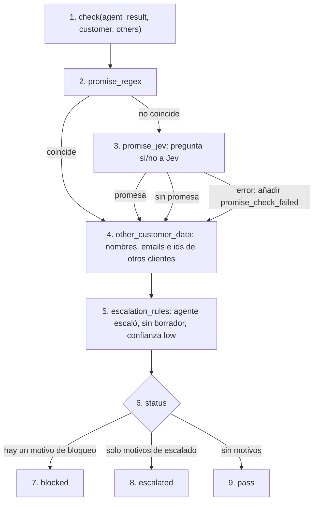

# guardrails

## Purpose
`app/guardrails.py` revisa cada borrador antes de la UI. Bloquea las promesas de reembolso o de plazo y los datos de otro cliente. Escala los casos que necesitan a una persona.

## Diagram



## Interface

```python
@dataclass
class GuardrailResult:
    status: Literal["pass", "blocked", "escalated"]
    reasons: list[str]

def check(result: AgentResult, customer: Customer, others: list[Customer], *,
          ticket_text: str = "", promise_checker=jev_promise_check) -> GuardrailResult
```

| Motivo | Efecto |
|---|---|
| `refund_promise`, `deadline_promise` | bloqueo |
| `other_customer_data` | bloqueo |
| `promise_check_failed` | escalado |
| `agent_escalated` | escalado |
| `no_draft` | escalado |
| `low_agent_confidence` | escalado |

## Behavior

1. `check()` recibe el resultado del agente, el cliente del ticket y los demás clientes.
2. `promise_regex` busca frases de promesa en español, catalán e inglés. Ejemplos: "te devolvemos", "reembolso garantizado", "te garantizo que hoy". Si coincide, no llama a Jev.
3. `promise_jev` pregunta a Jev si el borrador promete un reembolso, una compensación o un plazo garantizado. Detecta las promesas implícitas. Si Jev falla, añade `promise_check_failed`.
4. `other_customer_data` busca en el borrador los nombres, emails, ids de cliente e ids de factura de los otros clientes. Un dato que ya está en el texto del ticket no cuenta: repetir lo que escribió el cliente no es una fuga. Ejemplo: "no podemos enviarte facturas de Grupo Brasa" (T-028).
5. `escalation_rules` añade los motivos de escalado.
6. `check()` calcula el status.
7. Un motivo de bloqueo da `blocked`: el borrador no se puede aprobar sin editar.
8. Solo motivos de escalado dan `escalated`.
9. Sin motivos, el status es `pass`.

Las comprobaciones 2 a 5 se ejecutan siempre. Así `reasons` muestra todos los problemas. Cada una es un span `guardrail` en Langfuse.

"Normalmente en menos de 24 horas laborables" (kb-02) no es una promesa. El regex solo busca compromisos: "te garantizo", "estará resuelto hoy".

## Errors and edge cases
- Borrador vacío: no hay comprobación de texto; el motivo es `no_draft`.
- El nombre del cliente del ticket nunca cuenta como dato de otro cliente.

## Done when
- [ ] Tests: promesa de reembolso → `blocked`; nombre de otro cliente → `blocked`; agente escaló → `escalated`; fallo de Jev → `escalated`; borrador limpio → `pass`; bloqueo gana a escalado.
- [ ] Un test confirma que no se llama a Jev cuando el regex coincide.
