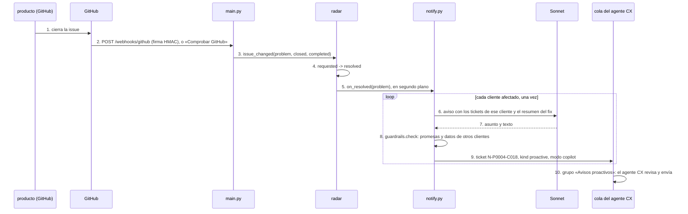

# notify

## Purpose
`app/notify.py` cierra el ciclo. Cuando producto cierra la issue de un problema, el copiloto redacta un aviso proactivo para cada cliente afectado. Cada aviso es un ticket nuevo en la cola, con un borrador. Un agente CX lo revisa y lo envía, como cualquier otro borrador. Así el cliente se entera antes de volver a escribir.

## Diagram



## Interface

```python
class Notice(BaseModel):
    subject: str
    body: str

def on_resolved(conn, problem_id: str, customers, *, client=None, promise_checker=jev_promise_check) -> list[str]
def notice_id(problem_id: str, customer_id: str) -> str          # "N-P0004-C018"

# app/radar.py
def issue_changed(conn, problem_id: str, state: str, state_reason: str | None) -> str | None   # "notify" o None
def sync_issues(conn, gh) -> list[str]                                                       # problemas a avisar
```

| Ruta | Respuesta |
|---|---|
| `POST /webhooks/github` | 401 sin firma válida. 202 con el evento `issues`. Fuera del basic auth: la firma es la autenticación. 403 en modo público. |
| `POST /radar/sync` | Lee las issues del repo con el label `radar` y aplica sus cambios. 403 en modo público. |

## Behavior

1. GitHub llama a `POST /webhooks/github` con el evento `issues`. El webhook comprueba `X-Hub-Signature-256` con `GITHUB_WEBHOOK_SECRET`.
2. Sin webhook (por ejemplo, en local), el botón «Comprobar GitHub» llama a `/radar/sync`, que lee las issues del repo.
3. `issue_changed()` busca el problema por el número de la issue y aplica la transición:
   - `closed` con `state_reason = completed`: `requested` → `resolved`, y hay que avisar.
   - `closed` con `not_planned`: `requested` → `dismissed`. No hay avisos: no hay fix que contar.
   - `reopened`: `resolved` → `requested`. Los avisos que ya están en la cola se quedan; el agente CX decide.
4. Cada transición es un `UPDATE … WHERE status = ?`. Un webhook repetido no cambia nada y no crea avisos nuevos.
5. `on_resolved()` recorre los clientes afectados. La tabla `notices` tiene `UNIQUE(problem_id, customer_id)`: un cliente recibe un aviso por problema, aunque la issue se cierre dos veces.
6. Sonnet recibe solo los tickets de ese cliente (asunto, fecha y texto), el título de la issue y el resumen del problema. No ve a los demás clientes. El prompt `proactive-notice` vive en Langfuse.
7. `guardrails.check()` revisa el aviso como cualquier borrador: promesas de reembolso o de plazo, y datos de otros clientes.
8. El aviso entra en la cola como ticket `N-P0004-C018`, con `kind = proactive`, `mode = copilot` (nunca manual: no es una línea base) y su `problem_id`.
9. La cola muestra el grupo «Avisos proactivos» primero. La ficha del ticket enseña una tarjeta con el problema, la issue y los tickets del cliente, en lugar del mensaje del cliente.
10. `/metrics` no mezcla los avisos con la comparación copilot/manual. Cuenta los avisos enviados aparte.

## Errors and edge cases
- Sonnet falla con un cliente: ese cliente no tiene aviso y el span lleva `WARNING`. Los demás siguen. «Comprobar GitHub» no lo repite: el problema ya está `resolved`. El botón «Redactar avisos que faltan» del detalle sí.
- Una issue que no es de ningún problema: el webhook responde 202 y no hace nada.
- Un cliente con un solo ticket hace semanas: el aviso cita esa fecha. Nunca inventa otra.

## Done when
- [ ] `tests/test_notify.py`: un aviso por cliente; un segundo cierre no crea más; los avisos van al grupo «Avisos proactivos»; los guardrails se ejecutan; `not_planned` no avisa; `reopened` vuelve a `requested`.
- [ ] `tests/test_web.py`: firma mala → 401; webhook sin basic auth; 403 en modo público.
- [ ] `evals/run_notices.py`: los avisos pasan los guardrails, citan la fecha de un ticket del propio cliente y no nombran a otro cliente.
