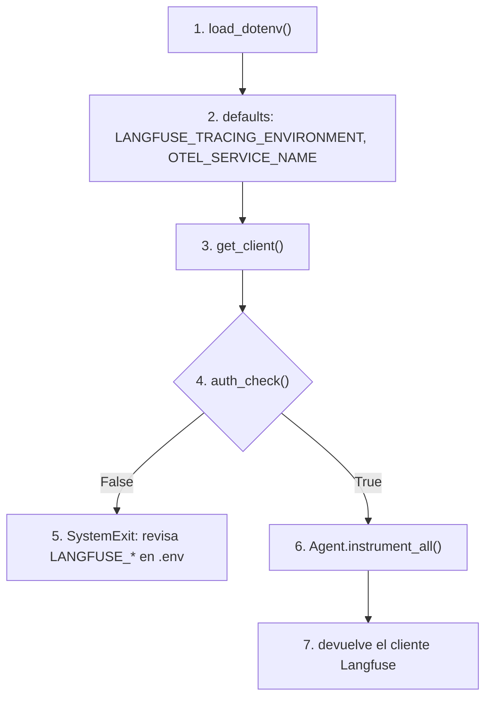
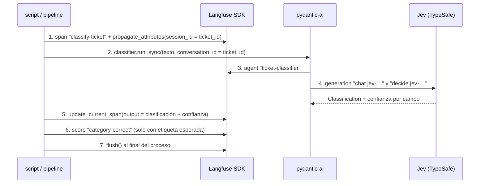

# observability

## Purpose
`app/observability.py` conecta la app con Langfuse en un solo sitio. Cada ticket produce una traza legible, con coste, confianza y sesión.

## Diagram

### Arranque: `init_tracing()`

### Una traza por ticket

## Interface

| Nombre | Tipo | Uso |
|---|---|---|
| `init_tracing()` | `() -> Langfuse` | Llama a esta función una vez, al arrancar, antes de crear clientes de LLM. |
| `TRACE_ENVIRONMENT` | `str` | Valor por defecto del entorno: `development`. |
| `SERVICE_NAME` | `str` | Valor por defecto de `OTEL_SERVICE_NAME`: `haddock-cx-copilot`. |

Contrato de la traza de un ticket:

| Campo | Valor |
|---|---|
| Nombre de la observación raíz | `classify-ticket` en Fase 0. `process-ticket` en Fase 2. |
| Input de la raíz | El texto del ticket. No los argumentos de la función. |
| Output de la raíz | La clasificación y la confianza de cada campo. |
| `session_id` | El id del ticket. La traza del pipeline y el score humano comparten sesión. |
| Metadata | `ticket_id`, categoría esperada si existe, origen. |
| Entorno | `LANGFUSE_TRACING_ENVIRONMENT`. Por defecto `development`. |
| Score | `category-correct`, `BOOLEAN`, solo si el ticket tiene etiqueta. |

Nombres de observación: verbo primero, sin ids ni nombres de modelo. El nombre del modelo está en el atributo `model` de la generation.

## Behavior

Arranque, con los números del flowchart:

1. `init_tracing()` carga `.env` antes de crear el cliente Langfuse.
2. Pone valores por defecto: entorno `development` y servicio `haddock-cx-copilot`. Una variable ya definida tiene prioridad.
3. Crea el cliente con `get_client()`.
4. Comprueba las credenciales con `auth_check()`.
5. Si las credenciales fallan, el proceso para con un mensaje claro.
6. Activa la instrumentación de `pydantic-ai`. Cada llamada a Jev produce un `agent` y una `generation` con modelo, tokens y coste.
7. Devuelve el cliente.

Traza de un ticket, con los números del sequenceDiagram:

1. El código abre la observación raíz y propaga `session_id`, metadata y nombre de traza.
2. El código pasa `conversation_id = ticket_id` a `pydantic-ai`. Así `pydantic-ai` no crea una sesión aleatoria.
3. `pydantic-ai` crea la observación `agent` con el nombre del `Agent`.
4. `pydantic-ai` crea la `generation` `chat` y la observación `decide`. `decide` guarda en metadata las preguntas, las probabilidades y la confianza de Jev.
5. El código escribe la clasificación y la confianza en el output de la raíz.
6. El código añade un score si conoce la respuesta correcta.
7. Un proceso corto llama a `flush()` antes de salir.

## Errors and edge cases

- **Credenciales no válidas:** `init_tracing()` para el proceso. No ejecuta llamadas a LLM sin traza.
- **Langfuse no responde durante la ejecución:** el SDK exporta en segundo plano. La app sigue y la traza se pierde.
- **Spans de HTTP o de base de datos:** el filtro por defecto del SDK v4 los descarta. Solo exporta spans de LLM y de Langfuse.
- **Datos personales:** los tickets de `data/` son sintéticos. Antes de usar tickets reales, añade una función `mask` al cliente.

## Open decisions

- Fase 2: `agent.py` usa el SDK de Anthropic. Instrumenta con `opentelemetry-instrumentation-anthropic` en `init_tracing()`, según la integración oficial de Langfuse.
- Los nombres `chat jev-…` y `decide jev-…` vienen de `pydantic-ai`. Contienen el modelo. Los aceptamos porque los crea la integración.

## Done when

- [ ] `uv run pytest` pasa. Un test comprueba la forma de la traza sin red, con `TestModel` y un exporter en memoria.
- [ ] `uv run python scripts/hello_jev.py` crea 3 trazas `classify-ticket`, una por ticket, con `session_id` = id del ticket.
- [ ] Cada traza tiene input = texto del ticket, output con confianza, entorno `development` y score `category-correct`.
