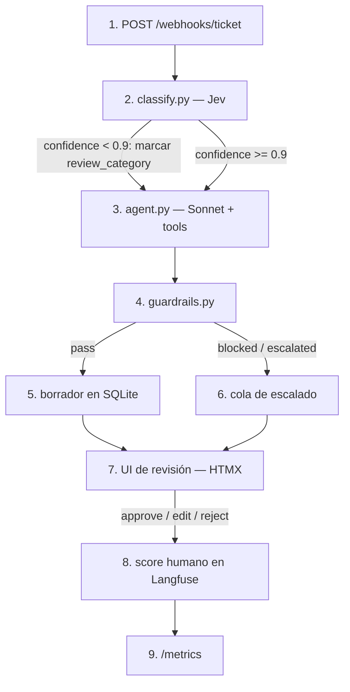
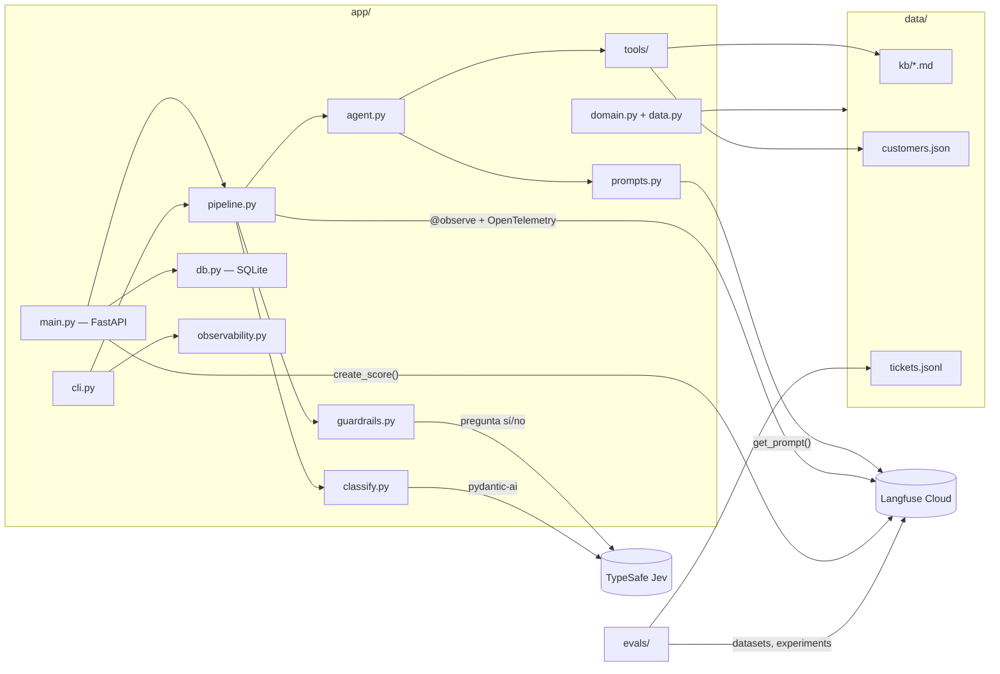

# overview

## Purpose
El CX Triage Copilot prepara la respuesta a cada ticket de soporte de haddock. Un agente CX revisa cada borrador y decide. Langfuse mide la calidad, el coste y el impacto.

## Diagram

### Flujo de un ticket

### Módulos y datos

## Behavior

1. Un ticket entra por `POST /webhooks/ticket`.
2. `classify.py` llama a Jev, un modelo de decisión de TypeSafe AI. Jev devuelve la categoría, la prioridad, el idioma y el sentimiento. Cada campo tiene una confianza calibrada.
3. `agent.py` investiga con las tools y escribe un borrador. Si la confianza de la categoría es menor que 0.9, el ticket lleva la marca `review_category` para el agente CX.
4. `guardrails.py` revisa el borrador.
5. Un borrador con status `pass` se guarda en SQLite.
6. Un ticket con status `blocked` o `escalated` va a la cola de escalado.
7. Un agente CX revisa el ticket en la UI.
8. La UI envía la decisión del agente CX a Langfuse como score de la traza.
9. `/metrics` calcula el impacto con las revisiones guardadas.

## Terms

| Término | Significado |
|---|---|
| ticket | Una petición de soporte de un cliente. |
| cliente | Un restaurante que usa haddock. |
| agente CX | La persona de soporte que revisa los borradores. |
| agente | El bucle de Sonnet en `agent.py`. No es una persona. |
| borrador | La respuesta que propone el agente. |
| escalar | Enviar el ticket a la cola de escalado, sin borrador válido. |
| traza | El registro en Langfuse de un ticket, del paso 2 al paso 8. |
| señal | Lo que el radar extrae de un ticket: componente, tipo, entidad y síntoma (`radar.md`). |
| problema | Un grupo de tickets con la misma causa de producto. |
| petición de producto | La issue de GitHub que el radar redacta para un problema. Un agente CX la aprueba. |
| aviso proactivo | El mensaje que el copiloto redacta para un cliente afectado cuando se resuelve el problema. |

## Module specs

| Módulo | Spec | Fase |
|---|---|---|
| Datos | `data.md` | 1 |
| `classify.py` | `classify.md` | 2 |
| `tools/` | `tools.md` | 2 |
| `agent.py` | `agent.md` | 2 |
| `guardrails.py` | `guardrails.md` | 2 |
| `pipeline.py` | `pipeline.md` | 2 |
| Trazas y prompts | `observability.md` | 3 |
| `evals/` | `evals.md` | 3 |
| UI y `db.py` | `ui.md`, `db.md` | 4 |
| `/intro` y `/presentacion` | `story.md` | 5 |
| `/codigo` | `tour.md` | 5 |
| Demo pública | `deploy.md` | 5 |
| Radar de producto | `radar.md` | R |
| Petición de producto | `product-request.md` | R3 |
| Cliente de GitHub | `github.md` | R3 |

## Done when
- [ ] Cada módulo de la tabla tiene su spec antes de su código.
- [ ] Este diagrama coincide con el código al final de cada fase.
