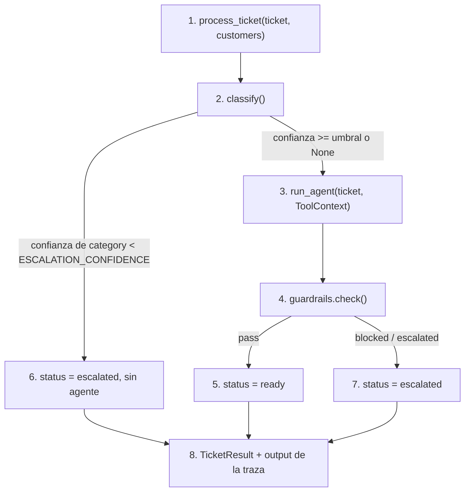

# pipeline

## Purpose
`app/pipeline.py` procesa un ticket de principio a fin: clasifica, investiga y revisa. `app/cli.py` lo ejecuta sobre `data/tickets.jsonl`. Cada ticket produce una traza `process-ticket` en Langfuse.

## Diagram



## Interface

```python
@dataclass
class TicketResult:
    ticket_id: str
    status: Literal["ready", "escalated"]
    classification: ClassifyResult
    agent: AgentResult | None
    guardrails: GuardrailResult | None
    reasons: list[str]
    trace_id: str
    cost_usd: float

def process_ticket(ticket: Ticket, customers: dict[str, Customer], *, kb: KBIndex) -> TicketResult
```

CLI:

```
python -m app.cli process data/tickets.jsonl [--limit N] [--ids T-001,T-020] [-v]
```

## Behavior

1. `process_ticket()` abre la traza `process-ticket`. `session_id` es el id del ticket. La metadata incluye el cliente.
2. `classify()` clasifica el ticket.
3. Con confianza suficiente, el agente investiga. El `ToolContext` contiene solo el cliente del ticket.
4. `guardrails.check()` revisa el borrador.
5. Con `pass`, el ticket está listo para revisión.
6. Con confianza baja en la categoría, el ticket se escala sin llamar al agente. Así no se gasta Sonnet. La confianza `None` (fallback de Haiku) no escala.
7. Con `blocked` o `escalated`, el ticket va a la cola de escalado. El borrador se guarda igualmente para el agente CX.
8. La salida de la traza contiene el status, los motivos, la clasificación y el borrador.

El umbral inicial es `ESCALATION_CONFIDENCE = 0.6`. La Fase 3 lo ajusta con los datos de calibración.

## Errors and edge cases
- Una excepción en `classify()` o `run_agent()`: el ticket se escala con el motivo `pipeline_error`. La traza registra el error con `level="ERROR"`.
- Un ticket con un `customer_id` desconocido: `KeyError`. Los tests de datos impiden este caso.

## Done when
- [ ] Un test confirma que la confianza baja escala sin llamar al agente.
- [ ] Un test confirma que `blocked` lleva a `escalated`.
- [ ] `python -m app.cli process data/tickets.jsonl --limit 5` procesa 5 tickets con borradores que citan evidencia, y Langfuse muestra 5 trazas `process-ticket`.
