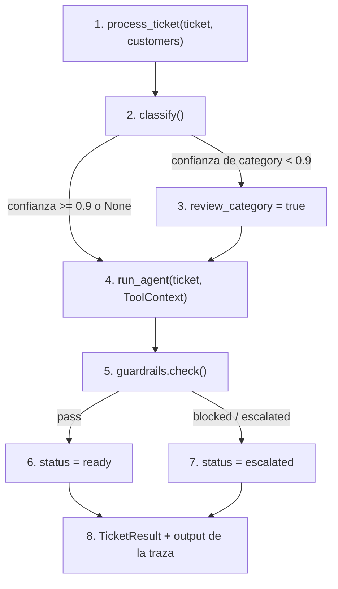

# pipeline

## Purpose
`app/pipeline.py` procesa un ticket de principio a fin: clasifica, investiga y revisa. `app/cli.py` lo ejecuta sobre `data/tickets.jsonl`. Cada ticket produce una traza `process-ticket` en Langfuse.

## Diagram



## Interface

```python
@dataclass(frozen=True)
class RunOptions:                      # variantes para los experimentos
    classifier: Literal["jev", "haiku"] = "jev"
    prompt_label: str = "production"
    classify_only: bool = False
    category_review_confidence: float = CATEGORY_REVIEW_CONFIDENCE

@dataclass
class TicketResult:
    ticket_id: str
    status: Literal["ready", "escalated"]
    classification: ClassifyResult | None
    agent: AgentResult | None
    guardrails: GuardrailResult | None
    reasons: list[str]
    trace_id: str
    review_category: bool

def process_ticket(ticket: TicketIn, customers: dict[str, Customer], *, kb: KBIndex,
                   options: RunOptions = RunOptions()) -> TicketResult
```

`TicketIn` es el ticket sin etiquetas: lo que llega por el webhook. `Ticket` (con etiquetas) hereda de `TicketIn`.

CLI:

```
python -m app.cli process data/tickets.jsonl [--limit N] [--ids T-001,T-020] [-v]
```

Con `-v`, la CLI muestra cada borrador, su evidencia y la URL de su traza en Langfuse.

## Behavior

1. `process_ticket()` abre la traza `process-ticket`. `session_id` es el id del ticket. La metadata incluye el cliente.
2. `classify()` clasifica el ticket.
3. Si la confianza de la categoría es menor que `CATEGORY_REVIEW_CONFIDENCE` (0.9), el pipeline marca `review_category`. La UI pide al agente CX que revise la categoría. La marca nunca escala el ticket.
4. El agente investiga. El `ToolContext` contiene solo el cliente del ticket.
5. `guardrails.check()` revisa el borrador.
6. Con `pass`, el ticket está listo para revisión.
7. Con `blocked` o `escalated`, el ticket va a la cola de escalado. El borrador se guarda igualmente para el agente CX.
8. La salida de la traza contiene el status, los motivos, la clasificación, la marca y el borrador.

**Por qué la confianza no escala.** La categoría no cambia el trabajo del agente. En la Fase 3, escalar con confianza menor que 0.6 causó entre 1 y 2 escalados incorrectos por ejecución, porque la confianza de Jev varía cerca del umbral. Con confianza de 0.9 o más, Jev acierta el 97% de las veces. Detalle en `docs/results.md`.

## Errors and edge cases
- Una excepción en `classify()` o `run_agent()`: el ticket se escala con el motivo `pipeline_error`. La traza registra el error con `level="ERROR"`.
- Un ticket con un `customer_id` desconocido: `KeyError`. El webhook lo rechaza antes con un 404.

## Done when
- [x] Un test confirma que la confianza baja marca `review_category` y el agente se ejecuta.
- [x] Un test confirma que `blocked` lleva a `escalated`.
- [x] `python -m app.cli process data/tickets.jsonl --limit 5` procesa 5 tickets con borradores que citan evidencia.
