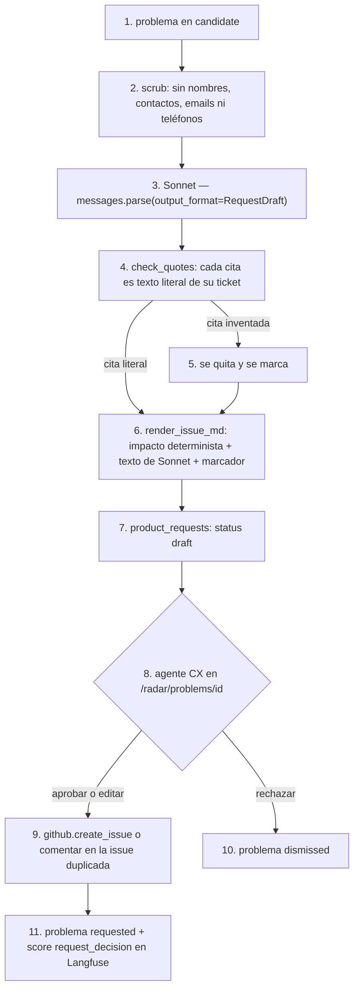

# product-request

## Purpose
`app/product_request.py` redacta la petición de producto de un problema: una issue de GitHub que un equipo de producto puede leer sin abrir ningún ticket. Sonnet escribe el texto. El código pone los números y comprueba las citas. Un agente CX aprueba la petición antes de crear la issue.

## Diagram



## Interface

```python
class RequestDraft(BaseModel):     # lo que escribe Sonnet
    title: str
    summary: str
    repro_steps: list[str]
    suspected_component: str
    acceptance_criteria: list[str]
    evidence: list[Evidence]       # {ticket_id, quote}

def draft_request(problem: dict, customers, *, client=None) -> ProductRequest
def scrub(text: str, customers) -> str
def check_quotes(evidence, texts: dict[str, str]) -> tuple[list[Evidence], list[Evidence]]   # (válidas, quitadas)
def render_issue_md(problem: dict, draft: RequestDraft, customers) -> str
```

## Behavior

1. La petición se redacta cuando el problema pasa a `candidate`, en segundo plano. También con el botón «Redactar la petición».
2. `scrub()` quita de los tickets los nombres de los clientes y de sus contactos, los emails y los teléfonos. Sonnet nunca ve esos datos. La issue tampoco.
3. Sonnet recibe los hechos del problema y hasta 12 tickets: los 3 primeros y los 9 más recientes. Devuelve un `RequestDraft` validado (`messages.parse`). El prompt `product-request` vive en Langfuse.
4. `check_quotes()` busca cada cita en el texto limpio de su ticket, sin contar mayúsculas ni espacios.
5. Una cita que no está en su ticket se quita. El número de citas quitadas va al span `quote-check` y a la UI.
6. `render_issue_md()` escribe la issue. Los números (tickets, clientes, MRR, severidad, tendencia, fechas) salen del código, no de Sonnet. Los clientes aparecen como `C-018 · pro · 1 local`, sin nombre. El cuerpo empieza con el marcador `<!-- haddock-problem:P-0004 -->`.
7. La petición se guarda en `product_requests` con status `draft`.
8. El agente CX lee la petición en el detalle del problema. Puede editar el título y el texto.
9. Al aprobar, `github.py` crea la issue con los labels `radar` y `bug` o `feature`. Si el agente CX elige «Añadir a #N», el radar comenta en esa issue y une los dos problemas.
10. Al rechazar, el problema pasa a `dismissed`. No vuelve a ser candidato.
11. La decisión (`approve`, `edit`, `reject`, `merge`) va a Langfuse como score `request_decision` de la traza `product-request`.

## Errors and edge cases
- Sonnet falla o rechaza: no hay borrador. La UI muestra el error y el botón «Redactar la petición».
- Todas las citas son inventadas: la petición se guarda sin evidencia y la UI lo marca en ámbar.
- GitHub falla al aprobar: la petición sigue en `draft` y la UI muestra el error. Nada se pierde.
- Modo público (`HADDOCK_PUBLIC=1`): redactar, aprobar y rechazar devuelven 403.

## Done when
- [ ] `tests/test_product_request.py`: una cita inventada se quita; el scrub quita nombres y emails; el marcador está en el cuerpo; los números salen del impacto.
- [ ] `evals/run_requests.py`: 100% de citas literales y los hechos obligatorios (entidad, clientes, MRR) en las 6 peticiones.
