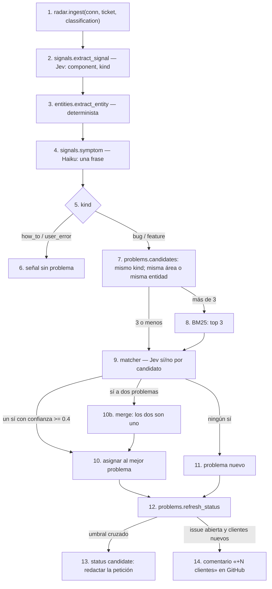
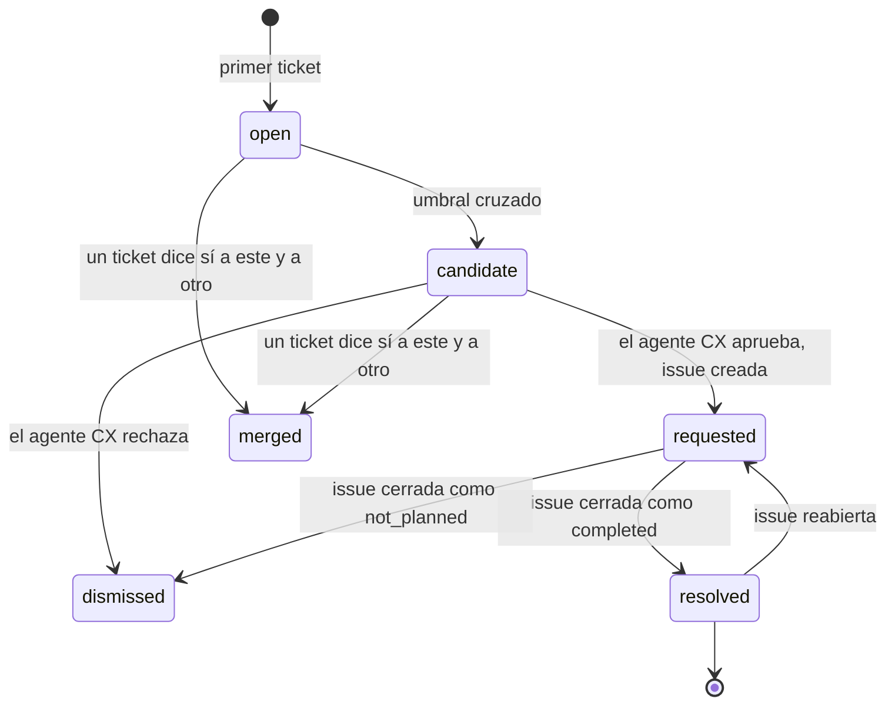

# radar

## Purpose
El radar de producto agrupa los tickets en problemas de producto. Ordena los problemas por impacto. Cuando un problema cruza el umbral, redacta una petición de producto para GitHub. Un agente CX la aprueba. Cuando producto cierra la issue, el copiloto redacta un aviso proactivo para cada cliente afectado.

El radar no está dentro del pipeline. `pipeline.py` no toca la base de datos. `radar.ingest()` se ejecuta después de `db.save_result()`, con su propia traza.

## Diagram

### Ingesta de un ticket



### Estados de un problema



## Interface

```python
# app/signals.py
class TicketSignal(BaseModel):   # Jev, sin instrucciones: cada descripción es la pregunta
    component: Component
    kind: Kind

def extract_signal(ticket, customer, gazetteer, *, classification=None, model=None, symptom_model=None) -> Signal

# app/entities.py
def extract_entity(text, customer, component, gazetteer) -> str | None

# app/problems.py
def assign(conn, signal: Signal, *, matcher=jev_same_problem) -> str | None   # problem_id
def merge(conn, group: list[dict], at: str) -> str                           # el id que sobrevive
def impact(signals: list[dict], customers, now: datetime) -> Impact
def refresh_status(conn, problem_id: str, customers, at: str) -> str         # status nuevo

# app/radar.py
def ingest(conn, ticket, customers, gazetteer, *, signal=None, classification=None, matcher=...) -> Signal
def backfill(conn, tickets, customers, *, workers=8, matcher=..., progress=None) -> list[Signal]
```

| Valor | Significado |
|---|---|
| `Component` | La parte del producto. El prefijo es la `Category`: `invoices.ocr`, `bank.sync`, `pos.sales`... |
| `Kind.bug` | Algo del producto no funciona como debe. |
| `Kind.feature` | El cliente pide algo que el producto no tiene. |
| `Kind.how_to` | El cliente no sabe cómo hacer algo, o pregunta si algo es posible («¿se puede…?»). El producto funciona. |
| `Kind.user_error` | El cliente hizo algo mal: una foto borrosa, una contraseña caducada. |

## Behavior

1. `ingest()` recibe un ticket ya guardado.
2. Jev responde dos preguntas tipadas: el componente y el tipo. Cada respuesta tiene una confianza calibrada.
3. `extract_entity()` busca en el texto un banco, un TPV o un proveedor conocido. No llama a ningún LLM.
   - Primero busca en la tabla del área: bancos para `bank.*`, TPV para `pos.*`, proveedores para `invoices.*`.
   - En `bank.*` y `pos.*`, si no encuentra ninguno, usa el banco o el TPV del cliente. El cliente solo tiene uno.
   - En `invoices.*` no hay valor por defecto: un cliente tiene muchos proveedores.
   - En las demás áreas busca en todas las tablas. «El P&L infla las ventas de Revo» es un ticket de `reports.pnl` sobre Revo.
   - Los tokens del nombre del cliente y de su contacto no cuentan. La firma «Elena Ruiz» no es el proveedor «Frutas Hermanos Ruiz».
4. Haiku escribe el síntoma: una frase corta y normalizada en español. Ejemplo: «El OCR no lee el total de las facturas de Distribuciones Garrido».
5. Solo los tipos `bug` y `feature` forman problemas.
6. Un `how_to` o un `user_error` guarda su señal, sin problema. Así los señuelos no ensucian los problemas.
7. Los candidatos son los problemas activos (`open`, `candidate`, `requested`) del mismo tipo. Un bug nunca se compara con una feature.
   - Si la señal tiene entidad: los problemas de la misma área o de la misma entidad, y con una entidad compatible (la misma, o ninguna). No pedimos el mismo componente: Jev pone algunos tickets de Garrido en `invoices.suppliers` y algunos de Revo en `reports.pnl`.
   - Si la señal no tiene entidad: solo los problemas del mismo componente. «El Excel del P&L suma el IVA» no debe llegar a un problema de Revo.
8. Con más de 3 candidatos, BM25 elige los 3 mejores. El documento de un problema es su título y sus 10 últimos síntomas.
9. Para cada candidato, Jev responde «¿Es el mismo problema de producto?». Si Jev falla, responde Haiku.
10. Gana el «sí» con la confianza más alta, si es 0.4 o más. En el spike, Jev acertó 20 de 20 pares, pero sus «sí» correctos tenían confianzas de 0.46 a 0.82. Con 0.8, casi todos los problemas se partirían. Una respuesta del fallback no tiene confianza y cuenta como 0.4.
11. Si la señal dice «sí» a dos problemas o más, esos problemas son uno: un «sí» débil anterior los partió. `merge()` los une. Sobrevive el que tiene issue, después el más grande, después el más antiguo. Los demás pasan a `merged`, con `merged_into`. Dos problemas con issue no se unen solos: lo decide una persona.
12. Si no hay ningún «sí», el ticket abre un problema nuevo. El título es su síntoma.
13. El componente y la entidad de un problema son los más frecuentes entre sus tickets, no los del primero.
14. `refresh_status()` calcula el impacto y comprueba el umbral.
15. El umbral es 3 clientes distintos, o 2 clientes con 400 € de MRR de clientes afectados como mínimo. Un solo cliente enterprise nunca basta: una sola voz no es un patrón. Al cruzarlo, el problema pasa a `candidate` y guarda `detected_at_n`: el número de tickets del problema en ese momento.
16. Si el problema ya tiene una issue abierta y tiene clientes nuevos, el radar añade el comentario «+N clientes» en GitHub (fase R3).

Cada transición de estado es un `UPDATE … WHERE status = ?`. Repetir una transición no tiene efecto. Cada transición añade una fila en `problem_events`.

**Impacto.** Es determinista y la UI muestra cada parte:
- MRR de clientes afectados: la suma de `billing.monthly_price_eur` de los clientes distintos.
- Severidad: la proporción de tickets `urgent` o `high`.
- Tendencia: (tickets de los últimos 7 días + 1) dividido por (tickets de los 7 días anteriores + 1). El +1 evita dividir por cero. El límite es de 0.5 a 2.
- `score = mrr × (1 + 0.5 × severidad) × tendencia`.

«Ahora» es la fecha del ticket más reciente de la base de datos, no `datetime.now()`. Así el mismo dataset da siempre los mismos números.

El texto de la UI dice «MRR de clientes afectados». No dice «churn» ni «ingresos en riesgo»: no predecimos el churn.

## Terms

| Término | Significado |
|---|---|
| señal | Lo que el radar extrae de un ticket: componente, tipo, entidad y síntoma. |
| síntoma | Una frase normalizada que describe el fallo, sin datos del cliente. |
| entidad | El banco, el TPV o el proveedor afectado. Puede ser vacía. |
| problema | Un grupo de tickets con la misma causa de producto. |
| petición de producto | La issue de GitHub que el radar redacta para un problema. |
| aviso proactivo | El mensaje que el copiloto redacta para un cliente afectado cuando se resuelve el problema. |
| MRR de clientes afectados | La suma de las cuotas mensuales de los clientes distintos de un problema. |

## Errors and edge cases
- Jev falla en la señal: responde Haiku y la confianza es `None`. Una señal sin confianza no cambia el flujo.
- El matcher falla con todos los candidatos: el ticket abre un problema nuevo y el span lleva `WARNING`. Es mejor partir un problema que mezclar dos.
- Dos tickets llegan a la vez: `assign()` usa un lock del proceso. Solo hay un proceso de uvicorn.
- Un ticket histórico (`source = history`) no aparece en la cola, pero sí en el radar.

## Done when
- [ ] `tests/test_problems.py` pasa con un matcher falso: filtro por componente y entidad, BM25 solo con más de 3 candidatos, `how_to` sin problema, problema nuevo contra asignación, umbral y `detected_at_n`, transiciones idempotentes.
- [ ] `evals/run_clustering.py` sobre `data/radar/tickets.jsonl` guarda purity, ARI, precisión del ruido y `detected_at_n` de cada problema plantado.
