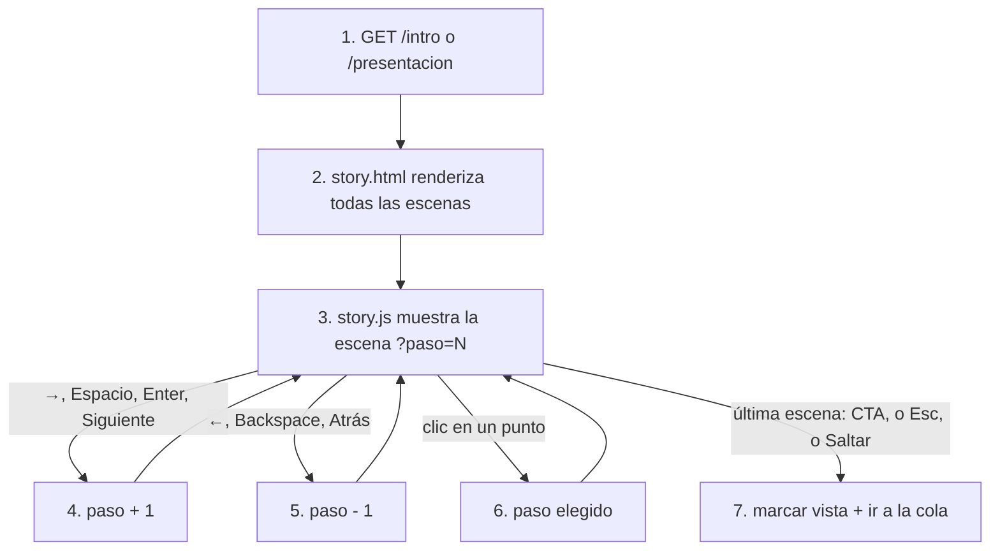
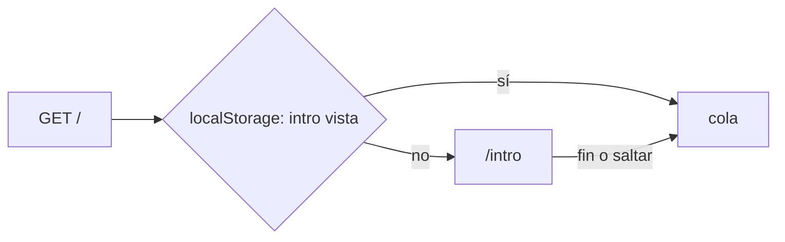

# story

## Purpose
`app/story.py` y la plantilla `story.html` muestran historias a pantalla completa, una escena cada vez. Hay dos historias con el mismo motor:
- `/intro`: el onboarding del agente CX. Cuenta qué hace el copilot y cómo se usa.
- `/presentacion`: las slides de la entrevista técnica, dentro de la app. Terminan en la demo en vivo.

El patrón viene del onboarding de airbenders (`hackspain_2026_airbenders/components/grifo/intro`).

## Diagram

### Motor de escenas



### Primera visita



## Interface

```python
@dataclass(frozen=True)
class Scene:
    kicker: str          # nombre corto del paso: etiqueta de los puntos de progreso
    title: Markup        # una frase; <em> marca el único acento de la pantalla
    visual: str | None   # nombre de la macro en templates/_scenes.html
    note: str | None     # una línea pequeña bajo el visual (fuente de una cifra)

INTRO: list[Scene]
PRESENTATION: list[Scene]
```

| Ruta | Historia | Final |
|---|---|---|
| `GET /intro` | `INTRO` | «Entrar a la cola» → `/` |
| `GET /presentacion` | `PRESENTATION` | «Ver la demo» → `/` |

Teclado: `→`/`Espacio`/`Enter` siguiente, `←`/`Backspace` atrás, `Esc` salir.

## Behavior

1. La ruta renderiza todas las escenas de la historia en una página.
2. Solo la escena activa es visible. Las demás tienen `hidden`.
3. `story.js` lee `?paso=N`. Sin parámetro, empieza en la escena 1.
4. Siguiente avanza una escena y actualiza la URL con `history.replaceState`.
5. Atrás retrocede una escena.
6. Un punto de progreso salta a su escena.
7. En la última escena, el CTA, `Esc` o «Saltar» guardan `haddock-cx-intro` en `localStorage` y abren la cola.

**Reglas de contenido:**
- Una frase por escena, con un solo acento. ASD-STE100: frases cortas y voz activa.
- Las cifras salen de `docs/results.md` o del código. Cada cifra lleva su fuente en `note`.
- Los tiempos de revisión simulados no se muestran como resultados.

**Movimiento:** los visuales entran con `story-rise` (opacidad y 10 px, 0,8 s). Con `prefers-reduced-motion`, no hay animación.

## Errors and edge cases
- `?paso` fuera de rango: se ajusta al primer o último paso.
- Sin JavaScript: se ve la primera escena y el enlace «Saltar» a la cola.
- `localStorage` bloqueado: la intro no se recuerda; «Saltar» sigue funcionando.

## Done when
- [ ] Tests: las dos rutas responden 200; cada escena tiene kicker y título; cada visual existe como macro.
- [ ] La primera visita a `/` abre `/intro`; después, la cola.
- [ ] Capturas de escritorio y móvil de las dos historias, revisadas.
