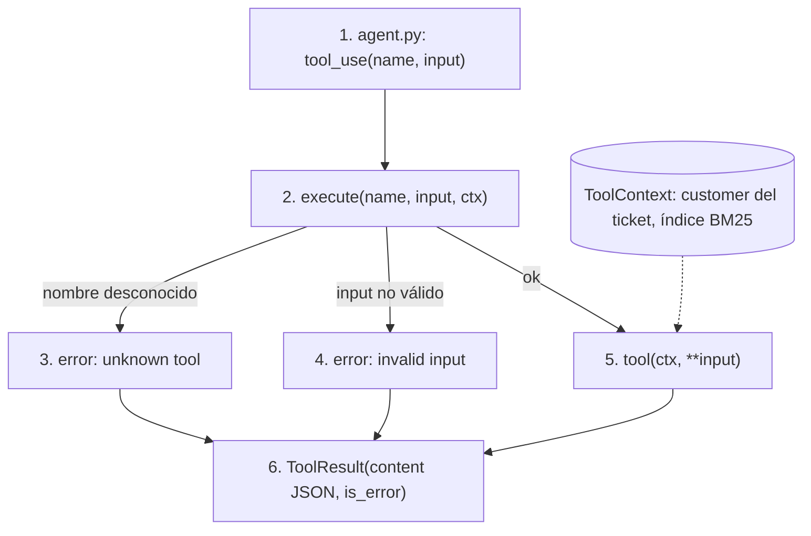

# tools

## Purpose
`app/tools/` define las tools que el agente puede llamar. Cada tool lee datos de `data/`. Las tools solo ven al cliente del ticket: el modelo nunca elige el cliente.

## Diagram



## Interface

```python
@dataclass
class ToolContext:
    customer: Customer          # el cliente del ticket, fijado por el pipeline
    kb: KBIndex                 # índice BM25 de data/kb

@dataclass
class ToolResult:
    content: str                # JSON
    is_error: bool = False
    escalation: Escalation | None = None

def tool_definitions() -> list[dict]          # para messages.create(tools=...)
def execute(name: str, input: dict, ctx: ToolContext) -> ToolResult
```

| Tool | Input | Devuelve |
|---|---|---|
| `search_kb` | `query` | Los 3 artículos más relevantes: id, título y texto. |
| `get_customer` | — | Plan, locales, facturación, integraciones y número de facturas por estado. |
| `get_invoices` | `status` opcional | Las facturas del cliente. |
| `get_bank_sync_status` | — | Las integraciones de banco: estado, última sincronización y error. |
| `escalate_to_human` | `team` (`support`, `tech`, `finance`), `reason` | Confirmación. Marca el ticket como escalado. |

## Behavior

1. El agente pide una tool con un nombre y un input.
2. `execute()` busca la tool en el registry.
3. Un nombre desconocido devuelve un error. El agente puede corregirse.
4. Un input que no cumple el schema devuelve un error.
5. La tool recibe el `ToolContext`. Lee solo los datos de `ctx.customer`.
6. El resultado vuelve al agente como JSON.

**Aislamiento de clientes.** Ninguna tool acepta un `customer_id`. El pipeline crea el `ToolContext` con el cliente del ticket. Por eso una pregunta sobre otro restaurante no puede devolver sus datos.

**`search_kb`.** Usa BM25 (`rank_bm25`) sobre el título y el texto de 15 artículos. El título cuenta dos veces. El texto se normaliza: minúsculas, sin tildes. Con 15 documentos, una base vectorial no aporta. Con cientos de artículos y sinónimos, pasa a embeddings con pgvector.

Cada tool tiene `@observe(as_type="tool")`. La traza muestra el input y el output de cada llamada.

## Errors and edge cases
- `search_kb` sin resultados: devuelve una lista vacía. El agente no inventa un artículo.
- Un cliente sin integraciones de banco: `get_bank_sync_status` devuelve una lista vacía.

## Done when
- [ ] Un test busca "el banco no sincroniza" y obtiene kb-07 entre los 3 primeros.
- [ ] Un test confirma que `get_invoices` solo devuelve facturas del cliente del contexto.
- [ ] Un test confirma el error de una tool desconocida.
