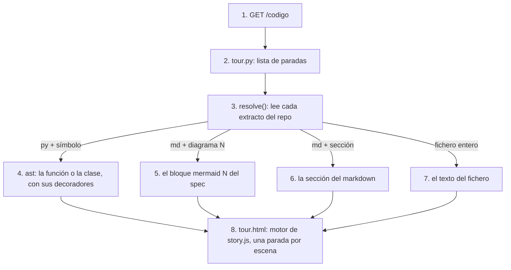

# tour

## Purpose
`/codigo` es el recorrido de la revisión de código de la entrevista, dentro de la app. Cada parada muestra una idea, el fichero donde vive y el código o el diagrama real. Enric y Guillermo lo pueden abrir también en la URL pública, después de la entrevista.

## Diagram



1. El agente CX o el entrevistador abre `/codigo`.
2. `app/tour.py` define las paradas en el orden de PLAN.md (fase 5): mapa, reglas, specs, clasificación, agente, tools, prompts, guardrails, trazas, evals y feedback humano.
3. `resolve()` lee el extracto en cada petición. El recorrido no tiene copias del código: siempre muestra el código actual.
4. Un extracto de Python nombra un símbolo (`run_agent`). `ast` devuelve su código, con los decoradores (`@observe`).
5. Un extracto de un spec nombra el número del diagrama Mermaid.
6. Un extracto de markdown puede nombrar una sección (`## Reglas`).
7. Sin símbolo, diagrama ni sección, el extracto es el fichero entero.
8. La página usa el motor de escenas de `/presentacion` (`story.js`): `←` `→`, puntos de progreso y `?paso=N`.

## Interface

```python
@dataclass(frozen=True)
class Excerpt:
    path: str                # relativo a la raíz del repo
    symbol: str | None       # función o clase de Python
    diagram: int | None      # 1 = primer bloque mermaid del markdown
    section: str | None      # título exacto, p. ej. "## Reglas"

@dataclass(frozen=True)
class Stop:
    kicker: str              # etiqueta de los puntos de progreso
    title: Markup            # una frase, un acento <em>
    points: list[str]        # 1–3 frases para decir en voz alta
    excerpts: list[Excerpt]

def resolve(excerpt: Excerpt) -> Shown   # Shown: kind ("code" | "mermaid" | "text"), language, text, location
TOUR: list[Stop]
```

| Ruta | Qué hace |
|---|---|
| `GET /codigo` | Todas las paradas con sus extractos resueltos. |

## Behavior

- El código se colorea con highlight.js y los diagramas se dibujan con Mermaid, los dos desde CDN.
- Cada extracto muestra su ubicación: `app/agent.py:107`.
- El estilo es el de las historias (`story.md`): mismo shell, paneles blancos y borde de 1 px.

## Errors and edge cases
- Un símbolo, diagrama o sección que no existe: `resolve()` lanza `LookupError`. Un test resuelve todas las paradas, así que un cambio de nombre rompe el test y no la página.
- La imagen del deploy copia `docs/specs`, `evals/*.py` y `CLAUDE.md`, porque el recorrido los lee.

## Done when
- [ ] Tests: cada parada resuelve todos sus extractos; un símbolo inexistente lanza `LookupError`; `/codigo` responde 200 y contiene el código de `run_agent`.
- [ ] `/codigo` funciona en la URL pública.
