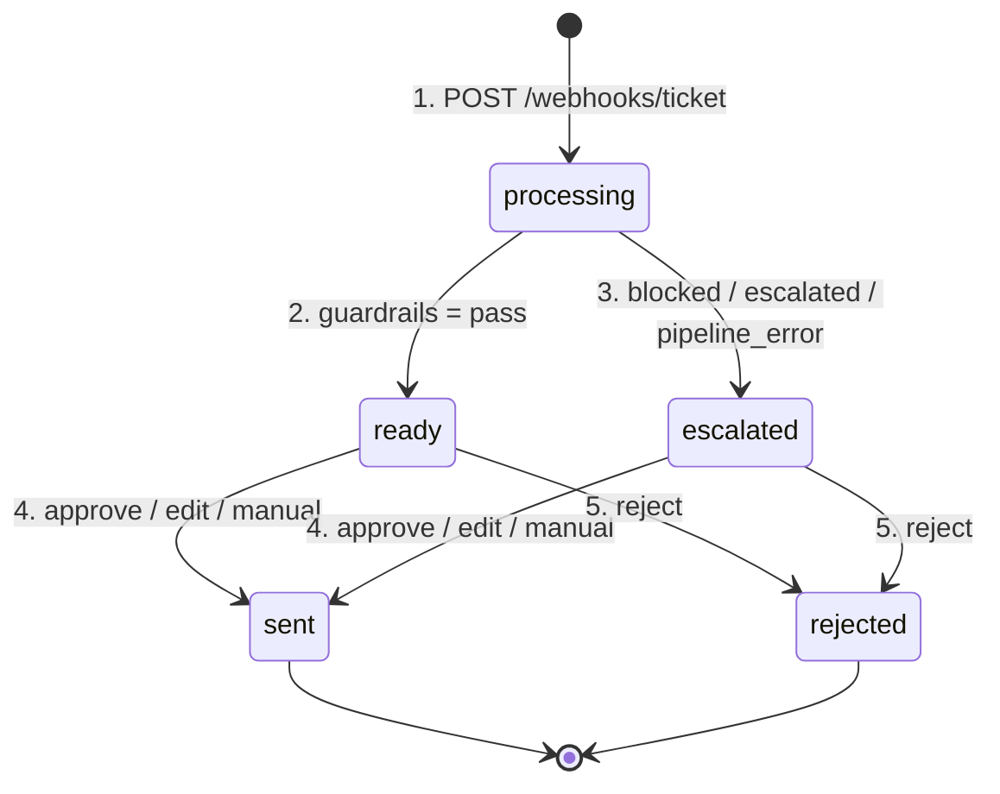
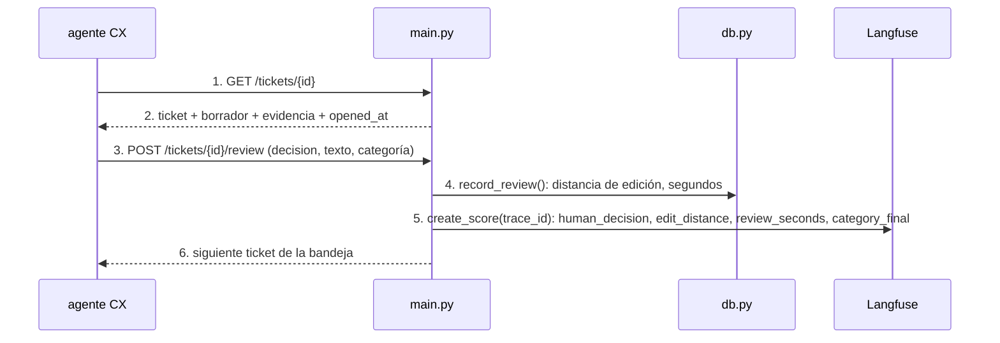

# ui

## Purpose
`app/main.py` es el puesto de trabajo del agente CX: una bandeja de tickets, el detalle con el borrador y la evidencia, y los botones de decisión. Cada decisión vuelve a Langfuse como score de la traza. `/metrics` mide el impacto.

## Diagram

### Estados de un ticket

### Una revisión

## Interface

| Ruta | Qué hace |
|---|---|
| `GET /` | Bandeja: tickets con cliente, asunto, categoría, prioridad, estado y marcas. Se actualiza cada 3 s mientras haya tickets en `processing`. |
| `GET /tickets/{id}` | Detalle: ticket, cliente, clasificación con confianza, motivos, borrador editable, evidencia, tools y enlace a la traza. |
| `POST /tickets/{id}/review` | Guarda la decisión y envía los scores. Redirige al siguiente ticket pendiente. |
| `POST /webhooks/ticket` | Entrada estilo Zendesk. JSON `TicketIn`. Responde 202 y procesa en segundo plano. 404 si el cliente no existe; 409 si el id existe. |
| `POST /demo/load?n=5` | Carga n tickets de `data/tickets.jsonl` por el mismo camino que el webhook. Para la demo. |
| `GET /metrics` | Métricas de impacto de `db.metrics()`. |

## Behavior

1. El webhook guarda el ticket en `processing` y responde 202.
2. Una tarea en segundo plano ejecuta `process_ticket()`. Con `pass`, el estado es `ready`.
3. Con `blocked`, `escalated` o un error, el estado es `escalated`. El borrador se muestra con los motivos en rojo.
4. El agente CX aprueba, edita o, en modo manual, escribe la respuesta. El ticket pasa a `sent`.
5. El agente CX rechaza el borrador. El ticket pasa a `rejected`.

**Modo manual.** Un 20% de los tickets no muestra el borrador. El agente CX escribe la respuesta desde cero. Así `/metrics` mide la línea base real.

**Tiempo de revisión.** La página guarda `opened_at` al mostrarse. El POST calcula los segundos hasta la decisión.

**Marca `review_category`.** La UI muestra la categoría en un selector, con un aviso. El agente CX la corrige si hace falta. La corrección vuelve a Langfuse como score `category_final`. Con esos datos se puede medir el acierto de Jev en producción.

**Scores en Langfuse**, en la traza `process-ticket` del ticket:

| Score | Tipo |
|---|---|
| `human_decision` | CATEGORICAL: approve, edit, reject, manual |
| `edit_distance` | NUMERIC, 0–1 |
| `review_seconds` | NUMERIC |
| `category_final` | CATEGORICAL |

**Tecnología.** FastAPI, Jinja2 y HTMX desde CDN. CSS mínimo con Pico.css. No hay build de frontend.

## Errors and edge cases
- Langfuse no responde al enviar los scores: la revisión se guarda igualmente en SQLite. El error va al log.
- Un ticket sin borrador (`pipeline_error`): la UI muestra el textarea vacío, como en modo manual.

## Done when
- [ ] Tests con `TestClient`: el webhook crea un ticket y responde 202; un id duplicado da 409; un cliente desconocido da 404; una revisión cambia el estado y envía los scores (con Langfuse simulado).
- [ ] El flujo completo funciona en el navegador con datos reales y los scores aparecen en la traza.
