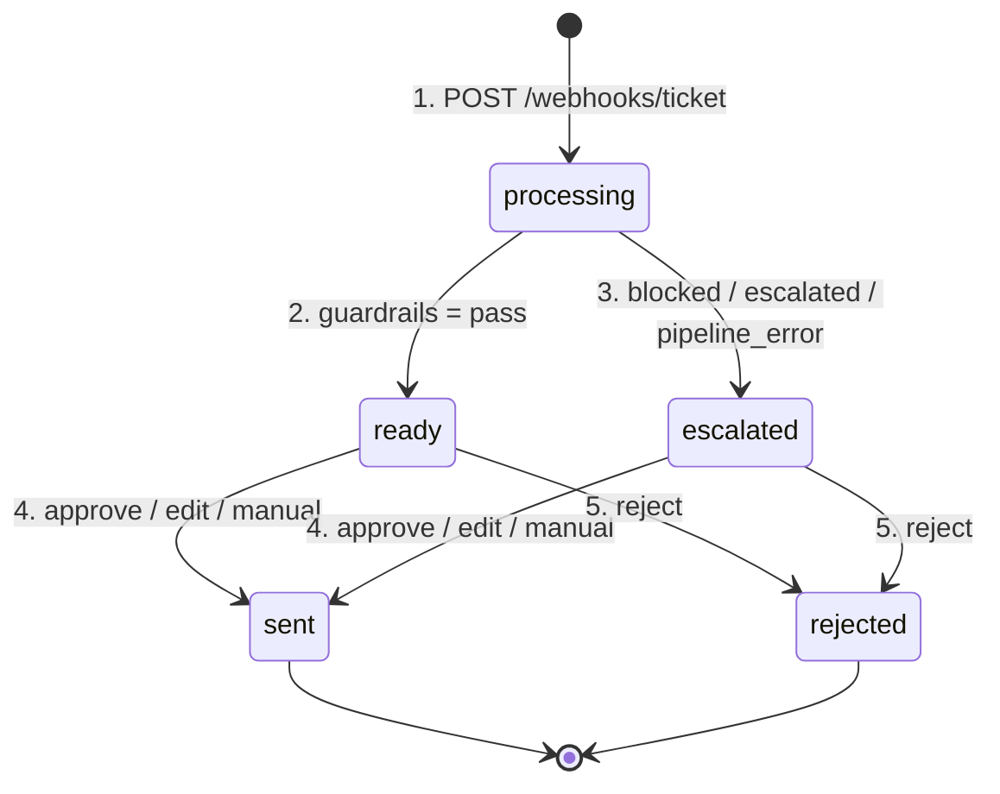
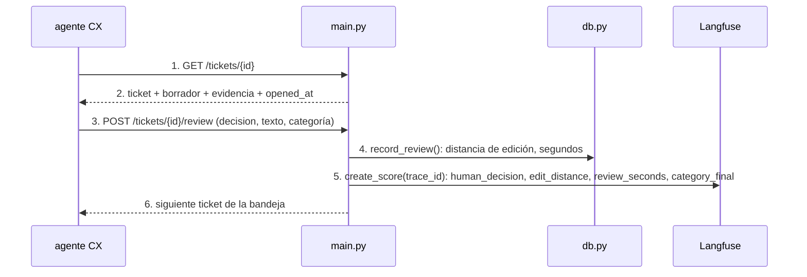
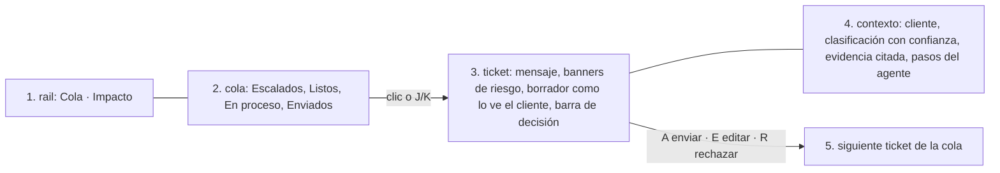

# ui

## Purpose
`app/main.py` es el puesto de trabajo del agente CX: una bandeja de tickets, el detalle con el borrador y la evidencia, y los botones de decisión. Cada decisión vuelve a Langfuse como score de la traza. `/metrics` mide el impacto.

## Diagram

### Estados de un ticket

### Una revisión

### Pantalla: tres paneles

1. El rail lleva a la cola o a Impacto. El contador muestra los tickets pendientes.
2. La cola agrupa por lo que exige acción: escalados primero, urgentes arriba. Enviados y rechazados quedan plegados.
3. El ticket muestra el mensaje, los banners de riesgo (motivo del escalado, guardrails, categoría dudosa, modo manual) y el borrador renderizado tal como lo verá el cliente. `E` abre el editor.
4. El panel de contexto muestra lo que leyó el agente: facturas, banco, cliente y artículos de ayuda, con la evidencia citada primero. Por debajo de 1080 px, el panel pasa debajo del borrador.
5. Cada decisión lleva al siguiente ticket pendiente.

La identidad visual es el estándar de helpdesk (listón: Zendesk Agent Workspace). El brief y el contrato de dirección están en `.impeccable/surfaces/app-templates.md`.

## Interface

| Ruta | Qué hace |
|---|---|
| `GET /` | Cola + estado vacío con "abrir el primero" (`J`). |
| `GET /queue` | Parcial HTMX de la cola. Se actualiza cada 4 s mientras haya tickets en `processing`. |
| `GET /tickets/{id}` | Ticket en el panel central y contexto a la derecha. Mientras está en `processing`, se recarga cada 3 s. |
| Teclado | `J`/`K` siguiente y anterior, `A` enviar, `E` editar, `R` rechazar, `Esc` salir del editor, `Ctrl+Enter` enviar desde el editor. |
| `POST /tickets/{id}/review` | Guarda la decisión y envía los scores. Redirige al siguiente ticket pendiente. |
| `POST /webhooks/ticket` | Entrada estilo Zendesk. JSON `TicketIn`. Responde 202 y procesa en segundo plano. 404 si el cliente no existe; 409 si el id existe. |
| `POST /demo/load?n=5` | Carga n tickets de `data/tickets.jsonl` por el mismo camino que el webhook. Para la demo. |
| `GET /metrics` | Métricas de impacto de `db.metrics()`. |

## Behavior

1. El webhook guarda el ticket en `processing` y responde 202.
2. Una tarea en segundo plano ejecuta `process_ticket()`. Con `pass`, el estado es `ready`.
3. Con `blocked`, `escalated` o un error, el estado es `escalated`. El borrador se muestra con los motivos en rojo.
4. El agente CX aprueba, edita o, en modo manual, escribe la respuesta. El ticket pasa a `sent`.
5. El agente CX rechaza el borrador. El ticket pasa a `rejected`.

**Modo manual.** Un 20% de los tickets no muestra el borrador. El agente CX escribe la respuesta desde cero. Así `/metrics` mide la línea base real.

**Tiempo de revisión.** La página guarda `opened_at` al mostrarse. El POST calcula los segundos hasta la decisión.

**Marca `review_category`.** La UI muestra la categoría en un selector, con un aviso. El agente CX la corrige si hace falta. La corrección vuelve a Langfuse como score `category_final`. Con esos datos se puede medir el acierto de Jev en producción.

**Scores en Langfuse**, en la traza `process-ticket` del ticket:

| Score | Tipo |
|---|---|
| `human_decision` | CATEGORICAL: approve, edit, reject, manual |
| `edit_distance` | NUMERIC, 0–1 |
| `review_seconds` | NUMERIC |
| `category_final` | CATEGORICAL |

**Tecnología.** FastAPI, Jinja2 y HTMX y Lucide (iconos) desde CDN. CSS y JS propios en `app/static/`. No hay build de frontend. La lógica de presentación (borrador renderizado con escape de HTML, agrupación de la cola, evidencia) está en `app/views.py`, con tests.

## Errors and edge cases
- Langfuse no responde al enviar los scores: la revisión se guarda igualmente en SQLite. El error va al log.
- Un ticket sin borrador (`pipeline_error`): la UI muestra el textarea vacío, como en modo manual.

## Done when
- [ ] Tests con `TestClient`: el webhook crea un ticket y responde 202; un id duplicado da 409; un cliente desconocido da 404; una revisión cambia el estado y envía los scores (con Langfuse simulado).
- [ ] El flujo completo funciona en el navegador con datos reales y los scores aparecen en la traza.
